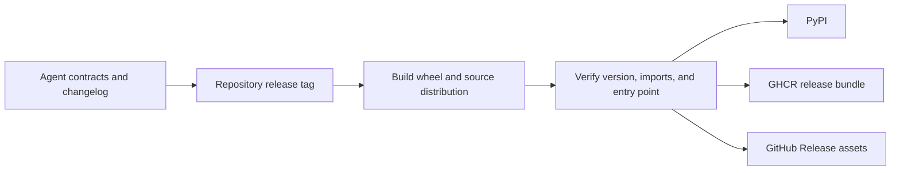

# Release and Versioning

`bijux-canon-agent` derives its version from the repository-wide
`v<version>` tag. A release binds role contracts, lifecycle rules, provider
adapters, configuration, trace schema, CLI and HTTP behavior, and terminal
outcome semantics to one tagged source state.



## What constitutes an agent release change

| Changed surface | Release significance |
| --- | --- |
| role input, output, veto, or error | handoff contract change |
| lifecycle transition or stop rule | orchestration authority change |
| convergence strategy or threshold | terminal-behavior change |
| provider adapter or model metadata | integration and reproducibility change |
| configuration field or default | deployment-policy change |
| trace header, entry, hash, or replay status | audit and compatibility change |
| final result path or reconstruction | artifact-custody change |
| CLI bootstrap, option, exit, or HTTP envelope | public interface change |

Describe the caller-visible effect in
`packages/bijux-canon-agent/CHANGELOG.md`. State whether historical traces can
still be loaded or upgraded, whether result reconstruction remains comparable,
and whether configuration or credential handling changed.

## Version and artifact guards

Hatch VCS resolves the package version from Git. Dirty or untagged source can
produce local or development versions; publication rejects them unless the
workflow explicitly permits that posture. Built wheel and source distribution
versions must match the resolved tag.

Changing fallback metadata does not publish a release. The tag, changelog,
installed metadata, CLI version, trace version fields, and filenames must agree.

## Focused release evidence

```bash
make test PACKAGE=bijux-canon-agent
make lint PACKAGE=bijux-canon-agent
make quality PACKAGE=bijux-canon-agent
make api PACKAGE=bijux-canon-agent
make build PACKAGE=bijux-canon-agent
```

Inspect the built distributions for the full package, `py.typed`, license,
README, canonical `bijux-canon-agent` entry point, and required configuration
or example assets. Install the wheel in isolation and prove one offline run can
produce a result and trace that reconstruct to the same outcome.

Live provider success is not a release gate for deterministic semantics unless
the release explicitly changes that provider integration. When it does, record
the tested provider/model identity and treat service availability separately
from package correctness.

## Compatibility and publication

`bijux-agent` and `agentic-flows` preserve earlier surfaces through explicit
compatibility packages. New lifecycle, trace, role, and provider meaning begins
in canonical packages; aliases must not acquire a competing orchestration
policy.

The same staged distributions feed PyPI, GHCR release bundles, and GitHub
Release assets. Multiple publication destinations preserve custody, not
independent agent behavior.

A release is incomplete when a historical trace can no longer explain its
terminal outcome and the incompatibility is absent from the changelog and
migration guidance.
