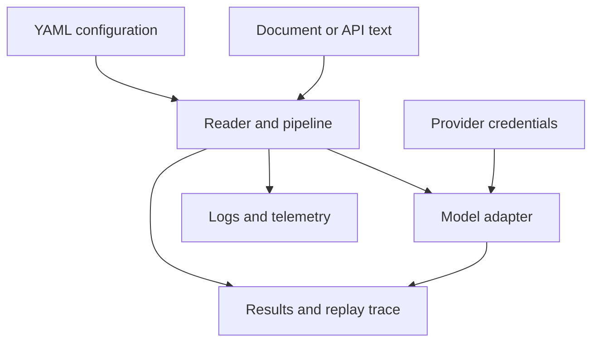

# Security and Safety

The agent package reads documents, can call configured model providers, and
writes document content, logs, results, and replay traces. Those are meaningful
authorities. Run it with filesystem and network permissions no broader than the
workload requires.

## Trust boundaries

The CLI accepts a caller-selected file or each immediate file in a selected
directory. It does not sandbox parsers or restrict paths to a repository root.
Use a dedicated input directory for untrusted documents and run the process as
an unprivileged account.

API input is written beneath `artifacts/api/inputs` using a SHA-256-derived
filename, and API logs and results are written beneath `artifacts/api`. The API
uses an offline `simple`/`extractive` configuration, so request configuration
cannot select a remote provider or arbitrary filesystem path.

## Credentials and sensitive data

- Supply provider keys through environment variables or a protected `.env`
  file. Do not place them in YAML, task text, document metadata, or traces.
- Restrict read permissions on `.env` and write permissions on artifact and log
  directories.
- Assume document text, prompts, model metadata, decisions, errors, and file
  paths can appear in durable logs or replay artifacts.
- Review artifacts before sharing them. A reproducible trace can still contain
  confidential source material or provider-derived output.
- Keep model temperature at zero for replayable traces and preserve the input,
  configuration, model, prompt, pipeline-definition, and convergence hashes.

The built-in key validator requires all registered provider keys even when a
particular CLI run is local. This is an availability constraint; it must not be
worked around by committing dummy secrets.

## HTTP deployment boundary

The minimal ASGI application exposes health and run endpoints. It does not
implement authentication, authorization, TLS, rate limiting, tenant isolation,
or an explicit request-body byte limit. The schema limits the input text to
200,000 characters, but that is not a transport-level memory bound because the
body is collected before validation.

Do not expose the application directly to an untrusted network. Put it behind a
gateway that enforces authenticated identities, authorization, TLS, request
bytes, concurrency, deadlines, and rate limits. Isolate each trust domain at
the process and artifact-root level.

Unexpected HTTP failures currently return their exception text as the error
message. Treat that as potentially sensitive operational detail: constrain
external access and avoid secrets in exceptions until a deployment boundary
redacts internal messages.

## Interpreting results safely

Validation proves conformance to declared schemas and lifecycle invariants.
Replay parity proves that recorded inputs and deterministic settings reproduce
the recorded output. Neither property establishes factual accuracy, fairness,
fitness for a downstream decision, or permission to use the source material.
