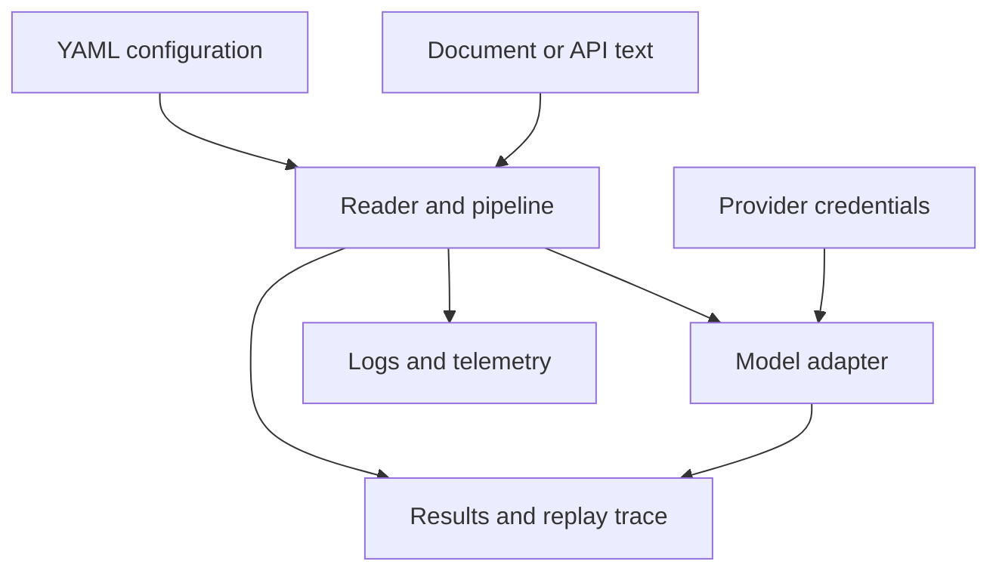

# Security and Safety

The agent package reads documents, can call configured model providers, and
writes document content, logs, results, and replay traces. Those are meaningful
authorities. Run it with filesystem and network permissions no broader than the
workload requires.

## Trust boundaries

The CLI accepts a caller-selected file or each immediate file in a selected
directory. It does not sandbox parsers or restrict paths to a repository root.
Use a dedicated input directory for untrusted documents and run the process as
an unprivileged account.

API input is written beneath `artifacts/api/inputs` using a SHA-256-derived
filename, and API logs and results are written beneath `artifacts/api`. The API
uses an offline `simple`/`extractive` configuration, so request configuration
cannot select a remote provider or arbitrary filesystem path.

## Credentials and sensitive data

- Supply provider keys through environment variables or a protected `.env`
  file. Do not place them in YAML, task text, document metadata, or traces.
- Restrict read permissions on `.env` and write permissions on artifact and log
  directories.
- Assume document text, prompts, model metadata, decisions, errors, and file
  paths can appear in durable logs or replay artifacts.
- Review artifacts before sharing them. A reproducible trace can still contain
  confidential source material or provider-derived output.
- Keep model temperature at zero for replayable traces and preserve the input,
  configuration, model, prompt, pipeline-definition, and convergence hashes.

The installed research registry is default-deny and read-only. Source text
cannot register a tool, select an implementation or version, change schemas or
capabilities, widen corpus/filesystem scope, increase cost/timeout limits, or
choose replay behavior. Tool records store exact request/result identities and
fixed safe summaries, not raw payloads or exception messages. Treat any new
summary field as a disclosure-boundary change and test it against credential,
secret, document-text, and path fixtures.

The built-in key validator requires all registered provider keys even when a
particular CLI run is local. This is an availability constraint; it must not be
worked around by committing dummy secrets.

## HTTP deployment boundary

The minimal ASGI application exposes health and run endpoints. It does not
implement authentication, authorization, TLS, rate limiting, tenant isolation,
or an explicit request-body byte limit. The schema limits the input text to
200,000 characters, but that is not a transport-level memory bound because the
body is collected before validation.

Do not expose the application directly to an untrusted network. Put it behind a
gateway that enforces authenticated identities, authorization, TLS, request
bytes, concurrency, deadlines, and rate limits. Isolate each trust domain at
the process and artifact-root level.

Unexpected HTTP failures currently return their exception text as the error
message. Treat that as potentially sensitive operational detail: constrain
external access and avoid secrets in exceptions until a deployment boundary
redacts internal messages.

## Classify data before a run

The same value may cross several durable surfaces. Define its disclosure and
retention class before execution:

| Data | Likely destinations | Control question |
| --- | --- | --- |
| document and task text | reader output, prompts, provider request, logs, result and replay trace | may this source leave the host and be retained by the provider? |
| provider credentials | environment/settings and outbound authorization | can any configuration, exception, log or trace serialize the value? |
| prompt and pipeline definition | provider request, hashes, trace and debugging records | does it contain proprietary policy, examples, or embedded source text? |
| provider response and usage | role output, merge/judge/validation records, logs and result | who may inspect raw output, safety refusal and billing metadata? |
| paths and parser diagnostics | logs, errors and trace metadata | do paths reveal tenant, user, mount, or document names? |
| convergence and veto evidence | trace, final result and replay comparison | is the complete decision history retained even when the result is rejected? |

A hash protects identity, not confidentiality. Small or predictable secrets,
document identifiers, and prompts may still be guessable; keep sensitive raw
values and their hashes inside the same authorization boundary unless policy
explicitly allows disclosure.

## Exercise security failures

| Fault or abuse case | Required behavior |
| --- | --- |
| caller selects a path outside the approved CLI input root | enclosing launcher denies it or process isolation prevents access |
| malformed or adversarial document triggers a reader/native tool failure | typed failure with source lineage; no fallback that silently drops content |
| document text attempts to direct a privileged role or reveal secrets | content remains untrusted input; provider output cannot change lifecycle or policy authority |
| provider timeout, cancellation, malformed response or quota failure | bounded call, stable failure class, visible retry/fallback and terminal disposition |
| plugin or injected component returns an invalid role result | contract refusal before merge, judgment, validation or trace finalization |
| logs or HTTP errors contain a provider key, source excerpt or internal path | disclosure failure, access containment and credential rotation where applicable |
| API requests exceed trusted byte/concurrency limits | gateway rejects them before body collection or pipeline work |
| trace and final result belong to different attempts | identity mismatch; neither artifact is presented as a complete run |
| artifact directory is shared by mutually untrusted callers | process/root isolation prevents cross-run read, overwrite and enumeration |

For an incident, stop new provider calls, preserve the affected configuration,
result, trace and logs with restricted access, record provider request/call
identities, and revoke exposed credentials before replaying. Reproduction must
use sanitized inputs unless handling policy authorizes the original data.

## Interpreting results safely

Validation proves conformance to declared schemas and lifecycle invariants.
Replay parity proves that recorded inputs and deterministic settings reproduce
the recorded output. Neither property establishes factual accuracy, fairness,
fitness for a downstream decision, or permission to use the source material.
