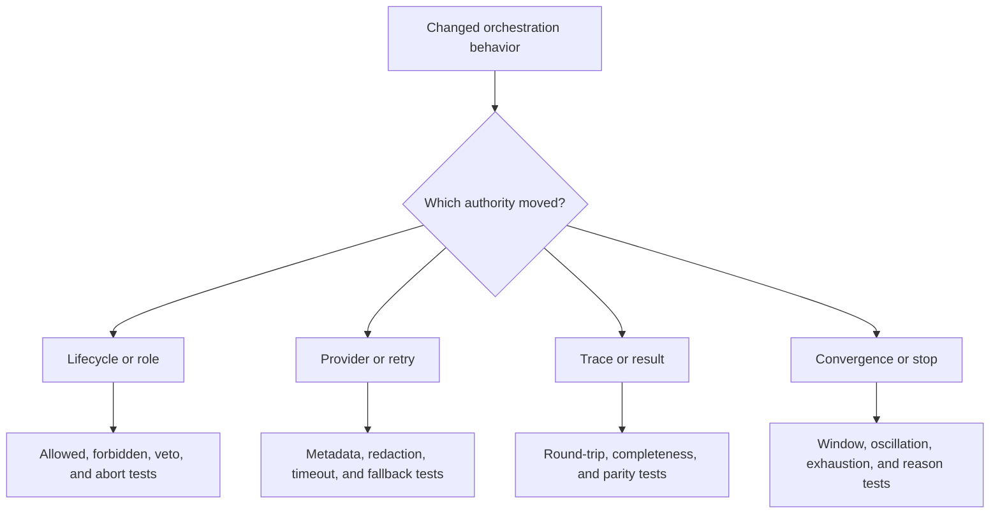

# Change Validation

Validate agent changes against causal reconstruction. A polished terminal
answer can conceal a skipped role, erased veto, unstable convergence decision,
provider fallback, or incomplete trace. The proof must expose those paths.



## Risk-to-evidence matrix

| Risk | Required focused evidence |
| --- | --- |
| a role advances control itself | forbidden-transition and controller-ownership tests |
| handoff loses substantive state | typed round-trip with input, output, issues, and lineage |
| veto is overwritten | merge, verification, finalization, and trace assertions |
| convergence is mistaken for correctness | stable-wrong and correct-nonconvergent fixtures |
| retry changes provider invisibly | ordered attempts, model metadata, error, budget, and fallback record |
| secrets enter evidence | trace, log, snapshot, error, and structured-output redaction tests |
| trace omits a failure | role error, controller decision, stop reason, and terminal entry assertions |
| result diverges from trace | reconstruction parity across pass, veto, abort, and dry-run paths |
| replay status ignores model parameters | temperature, model, configuration, and contract mismatch tests |
| HTTP and CLI meanings diverge | shared outcome-field assertions and interface-specific failure tests |

## Select the narrowest useful command

```bash
packages/bijux-canon-agent/.venv/bin/python -m pytest \
  packages/bijux-canon-agent/tests/<area>/<test-file>.py -q

make test PACKAGE=bijux-canon-agent
```

Add only affected boundary lanes:

```bash
make api PACKAGE=bijux-canon-agent
make lint PACKAGE=bijux-canon-agent
make quality PACKAGE=bijux-canon-agent
make build PACKAGE=bijux-canon-agent
make docs-check
```

## Prove failure paths without live secrets

Use deterministic providers, fakes, or recorded controlled responses for
lifecycle and trace evidence. Explicitly test timeout, rate limit, malformed
payload, cancellation, retry exhaustion, and fallback. Live-provider checks
may supplement adapter evidence but cannot replace deterministic failure tests
or prove replayability.

For trace changes, compare canonical snapshots with observational fields
excluded only where documented. Verify schema upgrade and malformed historical
input behavior before claiming compatibility.

Update configuration, artifact, limitation, and release documentation whenever
a role, transition, provider requirement, outcome field, trace version, or stop
condition changes.

Validation is sufficient when the final outcome can be reconstructed from the
retained trace and every alternate terminal path remains explicit.
