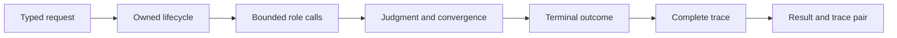

# Orchestration Release Acceptance

An agent change is releasable when role contracts, lifecycle authority,
convergence, termination, trace, and final artifacts tell one coherent story.
A persuasive final response is not evidence that the governed workflow ran
correctly.

## Acceptance record

| Changed surface | Required evidence | Release-blocking result |
| --- | --- | --- |
| role input or output | strict-model, unknown-field, failure, metadata, and serialization cases | malformed or ambiguous role data reaches orchestration |
| lifecycle transition | allowed/forbidden transition, passive-role, abort, and terminal-state evidence | a role or provider can override lifecycle policy |
| merge or shard handling | lineage, per-input status, conflict, and failure-assembly cases | one successful shard hides another shard's failure |
| judgment or verification | issues, action plan, decision, confidence, veto, and validation findings | terminal content loses the decision that admitted or rejected it |
| convergence | strategy, window, snapshot, hash, oscillation, maximum-iteration, and non-convergence cases | a stopped loop is relabeled as converged success |
| trace contract | mandatory fields, order, schema/runtime versions, deterministic exclusions, and reconstruction | the terminal outcome cannot be rebuilt from the trace |
| provider adapter | deterministic adapter failures plus opt-in live connectivity evidence | a live response substitutes for lifecycle or failure tests |
| CLI or HTTP boundary | typed parity, schema, dry-run, failure, and artifact-path evidence | an adapter changes status or trace semantics |
| result custody | `final_result.json`, named trace, and reconstruction comparison | the two files are missing, divergent, or from different attempts |

## Replay classification

A replayable trace carries complete input, configuration, model, version, and
convergence identity with temperature zero. This classification supports
deterministic reconstruction of recorded fields; it does not recreate a
provider's historical model-serving environment.

Use [change validation](change-validation.md) for focused routing and
[known limitations](known-limitations.md) to keep provider, credential, and
hosting claims bounded.
