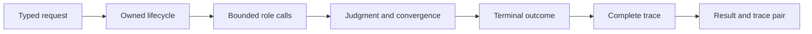

# Orchestration Release Acceptance

An agent change is releasable when role contracts, lifecycle authority,
convergence, termination, trace, and final artifacts tell one coherent story.
A persuasive final response is not evidence that the governed workflow ran
correctly.

## Acceptance record

| Changed surface | Required evidence | Release-blocking result |
| --- | --- | --- |
| role input or output | strict-model, unknown-field, failure, metadata, and serialization cases | malformed or ambiguous role data reaches orchestration |
| lifecycle transition | allowed/forbidden transition, passive-role, abort, and terminal-state evidence | a role or provider can override lifecycle policy |
| merge or shard handling | lineage, per-input status, conflict, and failure-assembly cases | one successful shard hides another shard's failure |
| judgment or verification | issues, action plan, decision, confidence, veto, and validation findings | terminal content loses the decision that admitted or rejected it |
| convergence | strategy, window, snapshot, hash, oscillation, maximum-iteration, and non-convergence cases | a stopped loop is relabeled as converged success |
| trace contract | mandatory fields, order, schema/runtime versions, deterministic exclusions, and reconstruction | the terminal outcome cannot be rebuilt from the trace |
| provider adapter | deterministic adapter failures plus opt-in live connectivity evidence | a live response substitutes for lifecycle or failure tests |
| CLI or HTTP boundary | typed parity, schema, dry-run, failure, and artifact-path evidence | an adapter changes status or trace semantics |
| result custody | `final_result.json`, named trace, and reconstruction comparison | the two files are missing, divergent, or from different attempts |

## Terminal outcomes are not interchangeable

Acceptance evidence must preserve why orchestration stopped and which work is
usable:

| Terminal condition | Required record | Prohibited interpretation |
| --- | --- | --- |
| converged success | criterion, observation window, snapshots or hashes, admitted result, and complete trace | the content is factually correct or runtime-accepted |
| completed without convergence | maximum-iteration or stopping rule, last candidate, and non-convergence status | successful convergence because the loop ended normally |
| partial result | completed and failed inputs, lineage, usable artifacts, and explicit partial verdict | whole-batch success based on one successful shard |
| veto or validation refusal | source role, issues, action plan, targeted artifact, and final disposition | infrastructure failure or missing output |
| provider or role failure | call identity, stable error class, retry/fallback decisions, and lifecycle response | empty content or a skipped role |
| interrupted or aborted | last causal event, lifecycle state, incomplete work, and recovery boundary | finalized trace or replayable completion |
| fatal orchestration failure | terminal reason, preserved partial evidence, and non-success exit/response | an ordinary role-level refusal |

The result schema, trace schema, lifecycle, and public adapter must agree on the
condition. A release is blocked if one surface reports success while another
retains failure, partial completion, veto, or non-convergence.

## Acceptance fixture set

The release candidate needs more than a golden success trace. Retain fixtures
for an allowed lifecycle, a forbidden transition, a passive role, a failed
provider call, a merge with one failed shard, a veto, oscillation or maximum
iterations, an interrupted run, trace reconstruction, and a mismatched
result/trace pair. Add CLI and HTTP cases when the changed contract crosses
those boundaries.

The invariant, integration, API, end-to-end, snapshot, trace, and provider
adapter suites carry different authority. Live-provider evidence may confirm
connectivity, but it cannot replace deterministic lifecycle, failure, and
trace fixtures. Record provider/model identity and isolate that evidence from
the package-owned orchestration verdict.

## Replay classification

A replayable trace carries complete input, configuration, model, version, and
convergence identity with temperature zero. This classification supports
deterministic reconstruction of recorded fields; it does not recreate a
provider's historical model-serving environment.

Use [change validation](change-validation.md) for focused routing and
[known limitations](known-limitations.md) to keep provider, credential, and
hosting claims bounded.
