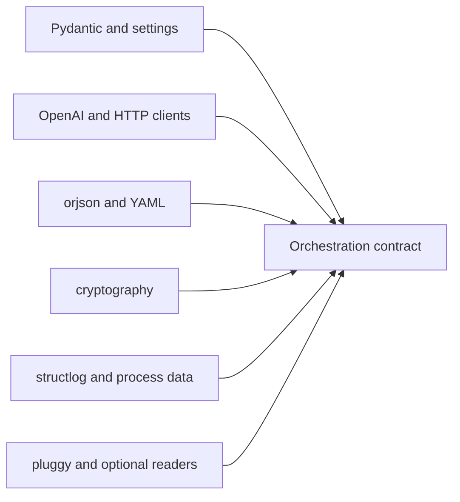

# Provider and Runtime Dependencies

Agent dependencies span contracts, configuration, network providers,
serialization, cryptography, observability, plugins, and document readers.
Each class can alter a different part of the trace or execution boundary.

## Dependency classes

| Boundary | Authority introduced | Evidence required when it changes |
| --- | --- | --- |
| Pydantic and settings | strict role models, configuration parsing, defaults, and environment resolution | contract matrix, default snapshots, and secret precedence tests |
| OpenAI, `aiohttp`, and Requests | provider protocol, timeout, response, usage, and network failure | adapter failure matrix, metadata/redaction, and opt-in live evidence |
| orjson and PyYAML | trace/configuration representation and scalar interpretation | canonical serialization, invalid input, and hash comparison |
| cryptography | protected-data primitives and failure behavior | round trip, invalid/tampered input, and version-specific compatibility |
| psutil and observability libraries | process measurements, logs, formatting, and retained telemetry | bounded/redacted output and unavailable-metric behavior |
| Injector and pluggy | component resolution and third-party extension authority | registration, isolation, failure, and layering invariants |
| optional document readers | file parsing, native tools, external OCR, and sensitive content access | format fixtures, size/failure limits, dependency identity, and sandbox policy |

## Admission rules

- Provider clients never acquire lifecycle or final-decision authority.
- A provider/model name is recorded with parameters, prompt/model hashes,
  usage, and failures wherever comparison depends on it.
- Configuration and serialization upgrades preserve secret redaction and trace
  compatibility.
- Optional readers remain absent from the base contract until installed and
  tested for the selected format and host environment.
- Plugin registrations cannot bypass strict contracts, lifecycle transitions,
  or trace completeness.

Dependency audits reveal known advisories and resolution conflicts. Live
provider behavior, native readers, OCR tools, and host isolation require
environment-specific evidence beyond a lock file.

## Admit changes by dependency lane

Do not approve the dependency set as one undifferentiated lock-file change.
Exercise the authority introduced by each changed lane:

| Dependency lane | Required comparison | Release-blocking result |
| --- | --- | --- |
| contracts and settings | role models, extra/unknown fields, environment/YAML precedence, defaults, secret redaction and lifecycle transitions | accepted input widens silently, a role gains authority, or a secret enters serialization |
| provider and HTTP clients | normalized request, model/parameters, response/usage metadata, timeout, retry, cancellation and typed provider failure | protocol details leak into public contracts or failure/usage identity disappears |
| orjson and YAML | canonical trace/configuration bytes, scalar interpretation, malformed input and hash derivation | the same meaning receives unstable identity or ambiguous configuration is accepted |
| cryptography | supported ciphertext/metadata round trip, wrong key, tampering, incompatible version and redacted failure | protected data becomes unreadable without a declared migration/refusal path or errors expose secrets |
| telemetry and process data | missing metric, bounded values, path/environment filtering, structured output and concurrency | observability changes workflow outcome or retains undeclared sensitive data |
| Injector and pluggy | registration order, duplicate/conflicting binding, lifecycle isolation, malformed output and exception mapping | extension code bypasses contracts, policy transitions or trace completeness |
| document readers and OCR | representative/malformed files, size and resource bounds, parser/native-tool identity, extracted-text custody | parser crash/escape, unbounded work, silent text loss, or missing source lineage |

Use deterministic fixtures for package-owned semantics and a separately
labelled live lane for provider, OCR, native parser, and host behavior. A live
success proves only the recorded environment and call; it cannot replace
failure, lifecycle, redaction, or replay fixtures.

## Provider-change evidence packet

Retain the client distribution/version, provider and model identity,
endpoint/service identity without credentials, normalized parameters, request
and prompt hashes, response and usage record, timeout/retry policy, failure
classification, pipeline definition, convergence observations, terminal state,
and complete trace. Compare provider upgrades through the agent-owned models,
not by accepting a raw SDK object or provider-specific exception as the public
contract.

If a provider cannot guarantee stable behavior behind a model name, state that
fact in the determinism classification. Temperature zero and identical request
hashes narrow variance; they do not establish provider immutability.

Use [test strategy](test-strategy.md) for deterministic and live evidence and
[risk register](risk-register.md) for residual provider and extension exposure.
