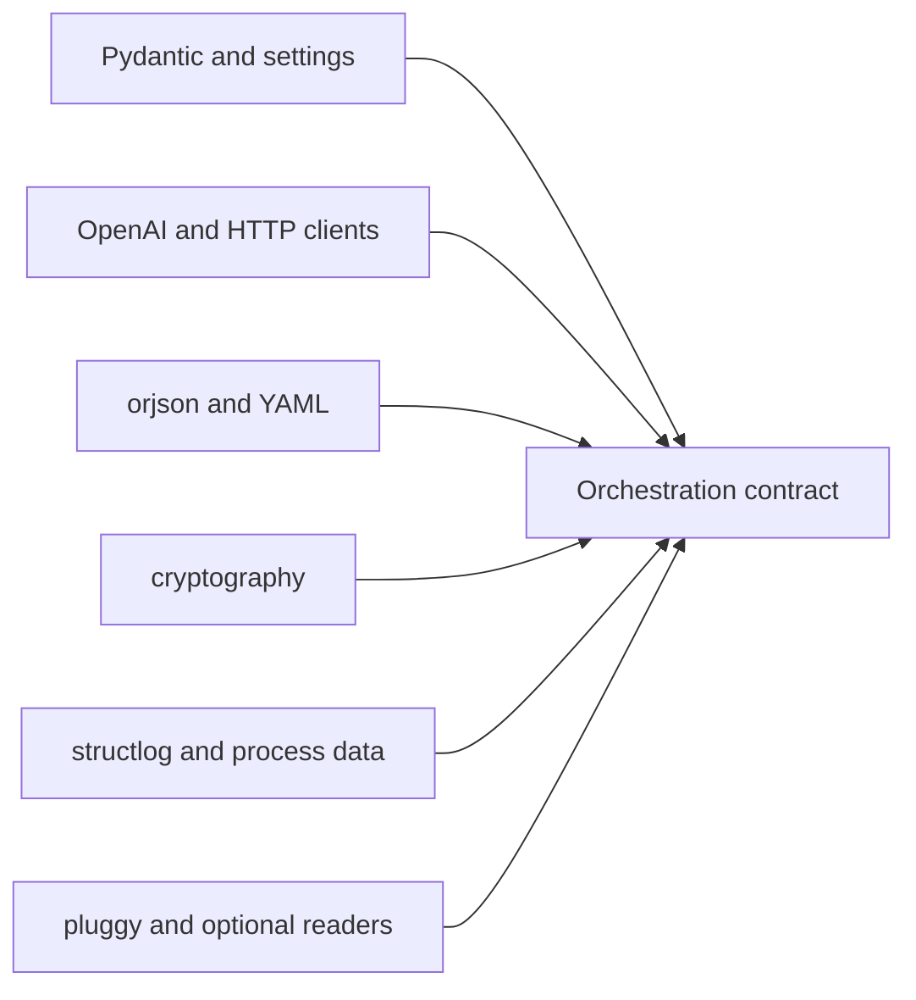

# Provider and Runtime Dependencies

Agent dependencies span contracts, configuration, network providers,
serialization, cryptography, observability, plugins, and document readers.
Each class can alter a different part of the trace or execution boundary.

## Dependency classes

| Boundary | Authority introduced | Evidence required when it changes |
| --- | --- | --- |
| Pydantic and settings | strict role models, configuration parsing, defaults, and environment resolution | contract matrix, default snapshots, and secret precedence tests |
| OpenAI, `aiohttp`, and Requests | provider protocol, timeout, response, usage, and network failure | adapter failure matrix, metadata/redaction, and opt-in live evidence |
| orjson and PyYAML | trace/configuration representation and scalar interpretation | canonical serialization, invalid input, and hash comparison |
| cryptography | protected-data primitives and failure behavior | round trip, invalid/tampered input, and version-specific compatibility |
| psutil and observability libraries | process measurements, logs, formatting, and retained telemetry | bounded/redacted output and unavailable-metric behavior |
| Injector and pluggy | component resolution and third-party extension authority | registration, isolation, failure, and layering invariants |
| optional document readers | file parsing, native tools, external OCR, and sensitive content access | format fixtures, size/failure limits, dependency identity, and sandbox policy |

## Admission rules

- Provider clients never acquire lifecycle or final-decision authority.
- A provider/model name is recorded with parameters, prompt/model hashes,
  usage, and failures wherever comparison depends on it.
- Configuration and serialization upgrades preserve secret redaction and trace
  compatibility.
- Optional readers remain absent from the base contract until installed and
  tested for the selected format and host environment.
- Plugin registrations cannot bypass strict contracts, lifecycle transitions,
  or trace completeness.

Dependency audits reveal known advisories and resolution conflicts. Live
provider behavior, native readers, OCR tools, and host isolation require
environment-specific evidence beyond a lock file.

Use [test strategy](test-strategy.md) for deterministic and live evidence and
[risk register](risk-register.md) for residual provider and extension exposure.
