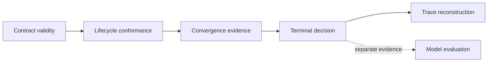

# Public Claim Standards

Agent claims describe orchestration evidence, not model truth. Deterministic,
converged, verified, replayable, and successful each name a different property
of a run.

## Claim vocabulary

| Public wording | Evidence required | Bound on the claim |
| --- | --- | --- |
| contract-valid role call | strict typed input, output or failure, metadata, and version | does not establish content correctness |
| governed lifecycle | declared phases, allowed transitions, passive roles, and terminal state | applies to the canonical pipeline or an equally declared custom graph |
| converged run | named strategy, window, observations, snapshot, hash, and typed reason | stable agreement can still be wrong |
| successful outcome | accepted terminal status, decision, validation, and termination reason | does not mean every shard or optional activity succeeded unless recorded |
| complete trace | mandatory header and ordered entries sufficient to reconstruct the outcome | cannot recover unrecorded provider or host events |
| replayable trace | complete replay metadata, deterministic fields, and zero temperature | does not reproduce historical provider serving |
| provider integration works | named provider/model, configuration, live response, usage, and failure behavior | proves connectivity, not truthfulness or future availability |
| CLI and HTTP parity | matching typed outcome and trace semantics for their shared contract | the fixed offline HTTP pipeline is narrower than the provider CLI |

## Result presentation

Final content is displayed with verdict, confidence, epistemic status, stop
reason, termination reason, convergence evidence, and trace identity. Veto,
abort, interruption, maximum-iteration exhaustion, and partial failure remain
visible even when useful text was produced.

## Credential language

Examples distinguish CLI bootstrap requirements from actual provider use and
the offline HTTP boundary. Placeholder keys are valid only in controlled tests
that cannot contact a provider. Live credentials stay outside configuration,
traces, logs, snapshots, and committed files.

See [invariants](invariants.md) for orchestration laws and
[risk register](risk-register.md) for authority, custody, and provider risks.
