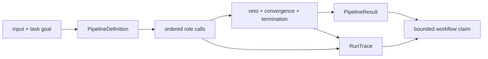

# Interpreting Agent Evidence

An agent result is a workflow record, not a claim that a model was correct.
Interpret final content together with the authorized roles, lifecycle,
provider calls, convergence decision, terminal status, and versioned trace.

## Read One Workflow Result

| Review question | Evidence to inspect | What remains unproven |
| --- | --- | --- |
| Which roles were allowed to act? | pipeline definition, resolved configuration, role order and fingerprint | whether the selected roles are sufficient |
| What did each role receive and return? | typed call record, input/output identity, provider/model metadata, failure | content truth or provider stability |
| Who controlled progression? | lifecycle transitions and controller decisions | that elapsed completion order defined authority |
| Why did work stop? | convergence, oscillation, veto, maximum-iteration, interruption and terminal records | that stopping implies correctness |
| What does the result classify? | status, decision, epistemic verdict, confidence, stop reason and issues | calibrated probability unless separately evaluated |
| Is the history complete? | trace header, ordered mandatory entries, schema version and completeness validation | events never exposed by the provider or host |
| What can replay establish? | retained inputs, deterministic fields, trace reconstruction and result comparison | historical provider serving or external tool state |

## Bounded Agent Vocabulary

| Claim | Required evidence | Bound on the claim |
| --- | --- | --- |
| contract-valid role call | strict input, output or failure, metadata, and version | does not establish content correctness |
| governed lifecycle | declared transitions, passive roles, controller decisions, and terminal state | applies to the canonical graph or an equivalently declared custom graph |
| converged run | named strategy, window, observations, snapshot, hash, and typed reason | stable agreement can still be wrong |
| successful outcome | accepted terminal status, decision, validation, and termination reason | cannot conceal failed shards or vetoes |
| complete trace | mandatory header and ordered entries sufficient to reconstruct the outcome | cannot recover unrecorded provider or host events |
| replayable trace | complete replay metadata, deterministic fields, retained inputs, and zero temperature | does not reproduce historical provider serving |
| provider connectivity | named provider and model, configuration, live response, usage, and failure behavior | proves neither truthfulness nor future availability |
| CLI and HTTP parity | matching outcomes and trace semantics for their shared contract | HTTP v1 currently uses a narrower fixed offline pipeline |

## Keep Output, Trace, And Acceptance Separate

Final content answers what the workflow produced. `RunTrace` answers how the
authorized roles, calls, transitions, vetoes, and convergence decisions
produced it. Runtime acceptance answers whether that traced workflow was
admitted under run policy. Store and display their identities together; none
can be reconstructed safely from another.

Useful text can accompany an aborted, vetoed, exhausted, interrupted, partial,
or non-converged outcome. Preserve that classification. A confidence number is
an agent-produced field until a versioned evaluation demonstrates calibration
for the intended domain.

## Provider Evidence Is External Evidence

A provider response is untrusted input even when it satisfies the adapter
schema. Retain provider and model identity, parameters, prompt and input hashes,
adapter configuration, usage, observed failure, and relevant tool identity.
Keep credentials outside configuration, traces, logs, artifacts, snapshots,
and committed examples.

Continue with [invariants](invariants.md) for enforced orchestration laws,
[known limitations](known-limitations.md) for provider, replay, credential, and
hosting bounds, and the [risk register](risk-register.md) for operational
failure signals.
