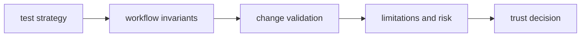

# Quality

Open this section when you need to decide whether workflow and trace behavior is proven strongly enough for operators and callers to trust deterministic orchestration.

## Trust Model

Agent quality has to defend more than successful runs. It has to show why
workflow ordering, traces, and deterministic coordination are still trustworthy
under change, and where the package is still honest about risk or limit
surfaces.

## Read These First

- open [Test Strategy](https://bijux.io/bijux-canon/05-bijux-canon-agent/quality/test-strategy/) first when you need the broad proof shape behind workflow behavior
- open [Invariants](https://bijux.io/bijux-canon/05-bijux-canon-agent/quality/invariants/) when the question is what must not drift across coordination and traces
- open [Change Validation](https://bijux.io/bijux-canon/05-bijux-canon-agent/quality/change-validation/) when you need the minimum proof for a safe agent change

## Trust Risk

The main quality risk here is workflow success that still leaves traces or review evidence too weak to defend the behavior.

## First Proof Check

- `tests` and package-local validation surfaces for executable evidence
- invariants, limitations, and risk pages for the trust boundaries that still matter after green checks
- release notes and caller-facing docs when the change alters what readers may safely assume

## Pages In This Section

- [Test Strategy](https://bijux.io/bijux-canon/05-bijux-canon-agent/quality/test-strategy/)
- [Invariants](https://bijux.io/bijux-canon/05-bijux-canon-agent/quality/invariants/)
- [Review Checklist](https://bijux.io/bijux-canon/05-bijux-canon-agent/quality/review-checklist/)
- [Documentation Standards](https://bijux.io/bijux-canon/05-bijux-canon-agent/quality/documentation-standards/)
- [Definition of Done](https://bijux.io/bijux-canon/05-bijux-canon-agent/quality/definition-of-done/)
- [Dependency Governance](https://bijux.io/bijux-canon/05-bijux-canon-agent/quality/dependency-governance/)
- [Change Validation](https://bijux.io/bijux-canon/05-bijux-canon-agent/quality/change-validation/)
- [Known Limitations](https://bijux.io/bijux-canon/05-bijux-canon-agent/quality/known-limitations/)
- [Risk Register](https://bijux.io/bijux-canon/05-bijux-canon-agent/quality/risk-register/)

## Leave This Section When

- leave for [Foundation](https://bijux.io/bijux-canon/05-bijux-canon-agent/foundation/) when the doubt is really about package ownership rather than proof
- leave for [Interfaces](https://bijux.io/bijux-canon/05-bijux-canon-agent/interfaces/) when the question is what the contract is rather than whether it is defended
- leave for [Operations](https://bijux.io/bijux-canon/05-bijux-canon-agent/operations/) when the package already seems trustworthy and the real issue is how to run it repeatably

## Design Pressure

If a workflow only looks deterministic because the trace is not reviewed hard
enough, this section is too weak. Quality here has to keep execution evidence,
trace invariants, and residual risk in one frame.
