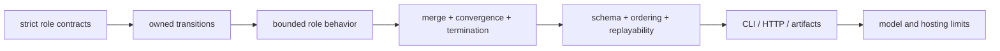

# Quality

Agent quality is the coherence of the orchestration record, not the fluency of
its final artifact. Contracts, lifecycle, convergence, termination, trace, and
public adapters each need focused proof before a run can be called auditable.

## Evidence chain

```mermaid
flowchart LR
    contracts["strict role contracts"]
    lifecycle["owned transitions"]
    roles["bounded role behavior"]
    outcome["merge + convergence + termination"]
    trace["schema + ordering + replayability"]
    boundary["CLI / HTTP / artifacts"]
    limits["model and hosting limits"]

    contracts --> lifecycle --> roles --> outcome --> trace --> boundary --> limits
```

## Claims and proof

| Trust claim | Required evidence | Important limit |
| --- | --- | --- |
| role calls have stable contracts | strict input/output/error and metadata tests | schema validity does not establish correctness |
| lifecycle authority is centralized | transition, kernel-order, architecture, and passive-role invariants | custom graphs need equivalent declared evidence |
| role behavior remains bounded | focused role tests and no-lifecycle-override checks | provider behavior remains external |
| sharded work has honest outcome | shard merge, failure assembly, final validation, telemetry tests | one success must not conceal failed inputs |
| convergence is reproducible | strategy, snapshot, window hash, oscillation, termination tests | stable agreement can still be wrong |
| traces are reviewable | mandatory fields, ordering, completeness, schema version, serialization tests | missing host/provider events cannot be reconstructed |
| replay designation is honest | frozen time, deterministic hash, zero-temperature, negative replay tests | replay does not recreate historical model serving |
| public surfaces agree | CLI/HTTP parity, OpenAPI, artifact, and golden example tests | HTTP v1 intentionally has a narrower fixed pipeline |

## Snapshot and live-test discipline

Snapshots protect architecture contracts, version defaults, kernel behavior,
trace schema, and representative artifacts. Review their semantic changes;
regenerating expected output without explaining a field, transition, or
default change erases compatibility evidence.

Live provider tests answer only whether an adapter can contact the provider
and record its response metadata. They are opt-in evidence and do not replace
deterministic orchestration tests or representative model evaluation.

## Separate the assurance domains

An auditable agent workflow combines evidence from three domains that cannot
substitute for one another:

| Assurance domain | What it can establish | Evidence to retain | What remains outside it |
| --- | --- | --- | --- |
| orchestration | authorized role order, lifecycle, merge, veto, convergence, termination and trace completeness | deterministic contract tests, transition records, snapshots and `RunTrace` | semantic quality of model output |
| model/provider | representative task behavior and observed remote-call metadata | declared evaluation set, provider/model identity, prompt/configuration, outputs, failures and usage | repeatability of an external service beyond captured observations |
| host/publication | file closure, storage identity, access, retention and interface delivery | file hashes, atomic publication record, permissions, CLI/HTTP result and recovery test | correctness of the pipeline decision itself |

A release claim must name which domain it covers. For example, lifecycle
snapshots can support orchestration compatibility but not summarization
quality; a live provider success can support connectivity but not replay; and
an atomically stored trace can support custody but not trace completeness
unless the agent validator accepted it first.

## Evidence routes

| Need | Guide |
| --- | --- |
| Understand contracts, lifecycle, trace, and boundary test layers | [Test strategy](test-strategy.md) |
| Review lifecycle, contract, trace, and convergence laws | [Invariants](invariants.md) |
| Select proof for a concrete change | [Change validation](change-validation.md) |
| Apply consistent review questions | [Review checklist](review-checklist.md) |
| Decide whether orchestration evidence is complete | [Definition of done](definition-of-done.md) |
| Govern model providers and optional integrations | [Dependency governance](dependency-governance.md) |
| Understand model, convergence, replay, credential, and hosting limits | [Known limitations](known-limitations.md) |
| Inspect unresolved workflow and operational risk | [Risk register](risk-register.md) |
| Interpret workflow results together with lifecycle and trace evidence | [Interpreting agent evidence](evidence-interpretation.md) |

Reproduce defects at the narrowest contract, role, lifecycle, convergence,
trace, or interface owner. Add pipeline-level proof when terminal status or
artifact completeness changes, and parity proof when adapters could diverge.
