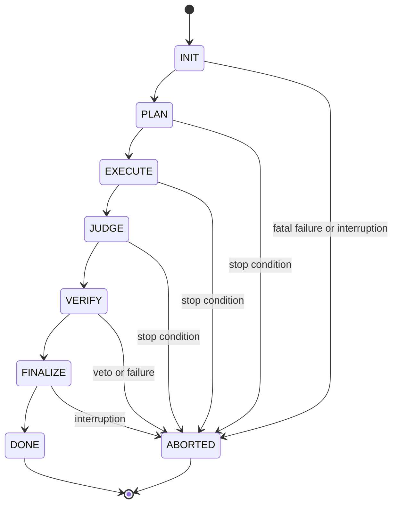

# Invariants

`bijux-canon-agent` coordinates specialized agents through a declared
lifecycle. A successful output is not enough: the route to that output must be
valid, bounded, traceable, and distinguishable from an aborted run.

## Canonical lifecycle

The standard pipeline definition permits only the forward success transitions
shown above and names `DONE` and `ABORTED` as terminal phases. Each active
phase declares entry conditions, exit conditions, allowed agent roles, and
recognized stop reasons. Agent implementations cannot override lifecycle
ownership or perform orchestration implicitly.

The lower-level agent execution kernel adds local ordering constraints: a
revision requires a prior run, and a run cannot resume after the kernel has
recorded failure.

## Contract invariants

| Contract | Guarantee |
| --- | --- |
| agent input | immutable, rejects extra fields, and carries a task goal, payload, context identifier, and metadata |
| agent output | immutable, rejects extra fields, contains non-blank text, and records confidence in `[0, 1]` |
| output metadata | includes the current agent contract version |
| call record | binds input, optional output/error, prompt hash, model hash, timestamps, and terminal call status |
| failure | uses a machine-readable failure mode and does not masquerade as successful output |

Mapping-style access to the final output schema is rejected. Consumers use
typed attributes, preventing a missing or misspelled field from degrading into
an ambiguous dictionary lookup.

## Trace invariants

Every recorded entry receives the run identifier and normalized replay
metadata. A run fingerprint binds the pipeline definition, allowed
transitions, terminal phases, skip reasons, contract version, and configuration
snapshot. The trace header records schema and runtime versions, agent versions,
configuration and pipeline hashes, model metadata, convergence evidence, and
termination reason.

Start and end times are classified as observational. Deterministic snapshots
exclude them while retaining inputs, outputs, scores, prompt/model hashes,
decisions, failures, lifecycle phase, and replay metadata.

A trace marked replayable requires:

- input, configuration, and model identifiers;
- complete model metadata;
- a convergence hash on finalization when convergence evidence exists;
- zero model temperature.

Non-zero temperature is allowed only when the trace is marked non-replayable.

## Convergence and termination

Convergence is a recorded decision, not an inference from “the loop stopped.”
Strategies evaluate score, verdict, confidence, or mixed stability over a
configured window and return a typed reason such as stability, oscillation,
maximum iterations, or confidence-only convergence. The serialized snapshot
and convergence hash allow the decision to be audited independently of the
final prose.

Termination retains its explicit reason even when no convergence criterion was
met. This distinguishes completed work, bounded exhaustion, verification veto,
user interruption, and fatal failure.

The [test strategy](test-strategy.md) maps lifecycle, contract, trace, and
convergence claims to focused executable evidence.
