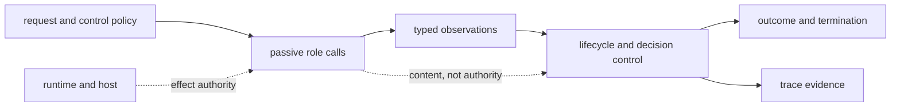

# Known Limitations

`bijux-canon-agent` governs role orchestration, lifecycle transitions,
convergence observations, termination, and trace evidence. It does not grant a
model authority, prove role content true, calibrate confidence automatically,
or isolate tool effects from the host.

## Authority Boundary

Roles propose or assess content. Typed control code owns transitions, stop
conditions, veto handling, and final status. A custom workflow assembled from
lower-level primitives does not inherit the canonical workflow's evidence or
authority separation unless it declares and validates equivalent transitions,
terminal states, and trace fields.

## Model Output Is Untrusted Input

A provider response can satisfy its schema and still be false, unsafe,
irrelevant, or adversarial. Temperature zero is necessary for the package's
replayable classification, but it is not sufficient to reproduce a hosted
model. Provider weights, routing, serving code, hidden system context, safety
policy, and dependencies can change behind the same public model name.

Retain provider, model, maximum token bound, temperature, runtime and contract
versions, prompt hash, model hash, adapter configuration, and relevant tool
identity. Confidence remains an agent-produced value until calibrated against
representative outcomes for the intended domain.

## Convergence And Completion Are Different

| Signal | What it establishes | What it does not establish |
| --- | --- | --- |
| stability | the configured signal remained within its threshold and window | correctness, adequacy, or independence among roles |
| confidence-only convergence | a configured confidence condition was met | calibrated probability or evidentiary support |
| oscillation | the monitor detected a repeated pattern and stopped | that either repeated answer is acceptable |
| maximum iterations | the configured iteration ceiling was reached | convergence or success |
| verification veto | a control rejected the candidate | that another acceptable candidate does not exist |
| completed termination | the workflow reached a completed terminal state | that downstream policy should accept or act on the content |

Consumers must interpret decision outcome, epistemic verdict, convergence
reason, stop reason, termination reason, issues, and trace identity together.
Displaying only answer text or a `converged` Boolean discards essential status.

## Replay Reconstructs Recorded State

Trace reconstruction checks canonical fields and can compare the reconstructed
`PipelineResult` with `final_result.json`. It does not invoke providers again or
recreate their historical serving environment. Observational timestamps are
excluded from deterministic snapshots. Missing replay fields, provider drift,
non-zero temperature, or absent input artifacts restrict the replay claim.

A digest can identify retained content and detect change; it cannot recover
prompts, inputs, provider responses, or tools that were never archived. Trace
schema upgrades make older records readable under declared mappings, but do not
invent missing historical evidence.

## CLI Credential Coupling

The current CLI validates all registered provider keys before dispatching the
selected command. Consequently, even help, dry-run, and replay through that
entry point require `OPENAI_API_KEY`, `ANTHROPIC_API_KEY`,
`HUGGINGFACE_API_KEY`, and `DEEPSEEK_API_KEY`. Library APIs and focused trace
utilities do not inherently require all four.

This is broader than least-privilege, command-specific secret loading. Do not
work around it by placing credentials in configuration files, trace metadata,
logs, fixtures, or shell history. Isolate the CLI process and inject only from
an approved secret provider.

## Deployment Boundary

The package is not a process sandbox, distributed scheduler, credential broker,
or transactional multi-host trace store. Tool file access, network egress,
provider quotas, cancellation, tenant isolation, artifact retention, and effect
recovery belong to `bijux-canon-runtime` and the hosting system. Live-provider
tests are opt-in connectivity evidence; they do not replace deterministic
orchestration and trace tests.

See the [risk register](risk-register.md) for operational hazards and the
[test strategy](test-strategy.md) for executable evidence.
