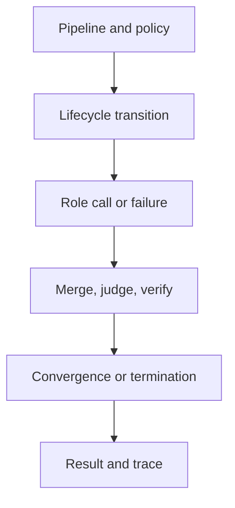

# Orchestration Review

Review reconstructs control flow independently of the final prose. Every role
action must be authorized by lifecycle state and represented in the terminal
outcome and trace.

## Reconstruct the outcome from the trace

Review `final_result.json` last. Begin with the trace header and derive the
outcome independently:

1. validate trace and runtime schema versions, run/context identity,
   configuration fingerprint, pipeline hash, and role versions;
2. replay lifecycle transitions in causal order and reject any role call that
   was not authorized by the preceding state;
3. join every call with its output or typed failure, including retry and
   fallback decisions;
4. follow shard and merge lineage so no input disappears behind an aggregate;
5. locate judgment, validation, critique, and veto records that constrain the
   candidate artifact;
6. recompute convergence or the non-convergence termination condition; and
7. derive verdict, confidence, epistemic status, stop reason, and trace
   completeness before comparing them with the final result.

```mermaid
flowchart LR
    header["trace header + identities"]
    calls["ordered transitions + calls"]
    lineage["shards + merges"]
    gates["judge + validate + veto"]
    stop["convergence or termination"]
    derived["derived terminal outcome"]
    file["final_result.json"]

    header --> calls --> lineage --> gates --> stop --> derived
    derived -->|compare| file
```

The comparison must fail visibly when the two artifacts come from different
attempts, when the trace is incomplete, or when a final field cannot be
derived. Adjacency on disk is not custody.

## Adversarial workflow cases

| Mutation or fault | Review expectation |
| --- | --- |
| role output requests a forbidden lifecycle transition | controller refuses it; the role cannot acquire policy authority |
| one shard fails while others succeed | partial or failed disposition retains every input lineage |
| convergence observations oscillate | non-convergence termination, not a synthetic stable result |
| provider times out after a retryable response | stable call failure plus visible retry/fallback history |
| veto is removed from the final summary | trace-derived outcome disagrees and blocks acceptance |
| timestamps differ across otherwise equivalent traces | causal comparison remains stable while observational time stays visible |
| trace path points to another attempt | run/context or artifact-identity mismatch is refused |
| CLI and offline HTTP overlap but return different typed status | adapter parity failure at the shared contract |

## Contracts and authority

- Do role inputs and outputs reject extra fields and retain contract version?
- Are lifecycle transitions owned by typed orchestration rather than prompts,
  role output, or provider adapters?
- Are forbidden transitions, aborts, interruptions, and shutdown behavior
  exercised?
- Does every call retain input identity, prompt/model hashes, output or error,
  and terminal call status?

## Decisions and termination

- Do merge and judgment records retain lineage, issues, action plan, verdict,
  confidence, and failures for every input?
- Is convergence tied to a named strategy, window, observations, and hash?
- Are oscillation and maximum iterations distinguished from successful
  convergence?
- Can veto, validation failure, interruption, and fatal failure reach the
  final status without being flattened into completed success?

## Trace and custody

- Do header versions, configuration/pipeline hashes, model metadata, agent
  versions, convergence, and termination identity agree with entries?
- Are observational timestamps excluded from deterministic comparison without
  deleting causal ordering?
- Can `final_result.json` be reconstructed from its named trace?
- Are mismatched, missing, or cross-attempt artifact pairs rejected?

## Providers and public boundaries

- Do provider failures cover timeout, rate limit, malformed response,
  redaction, retry, and fallback behavior?
- Is live-provider evidence kept separate from deterministic orchestration
  evidence?
- Do CLI and HTTP retain the same typed outcome where their contracts overlap?
- Are the offline HTTP application and provider-configurable CLI described as
  different execution surfaces?

Conclude with [orchestration release acceptance](definition-of-done.md) and
[known limitations](known-limitations.md).
