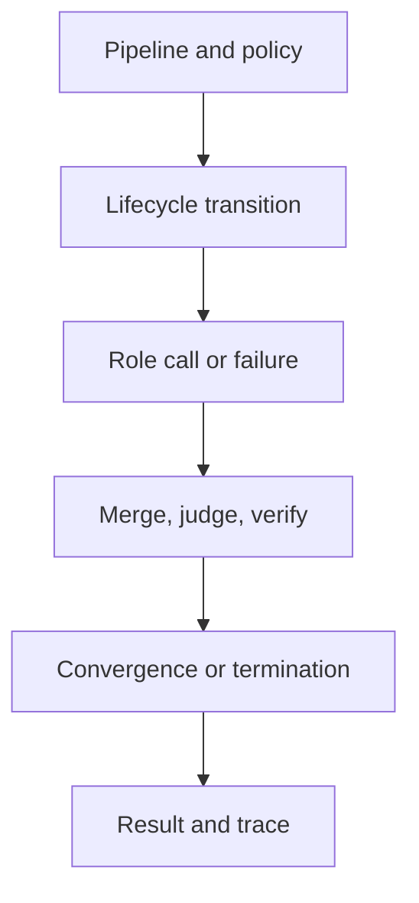

# Orchestration Review

Review reconstructs control flow independently of the final prose. Every role
action must be authorized by lifecycle state and represented in the terminal
outcome and trace.

## Contracts and authority

- Do role inputs and outputs reject extra fields and retain contract version?
- Are lifecycle transitions owned by typed orchestration rather than prompts,
  role output, or provider adapters?
- Are forbidden transitions, aborts, interruptions, and shutdown behavior
  exercised?
- Does every call retain input identity, prompt/model hashes, output or error,
  and terminal call status?

## Decisions and termination

- Do merge and judgment records retain lineage, issues, action plan, verdict,
  confidence, and failures for every input?
- Is convergence tied to a named strategy, window, observations, and hash?
- Are oscillation and maximum iterations distinguished from successful
  convergence?
- Can veto, validation failure, interruption, and fatal failure reach the
  final status without being flattened into completed success?

## Trace and custody

- Do header versions, configuration/pipeline hashes, model metadata, agent
  versions, convergence, and termination identity agree with entries?
- Are observational timestamps excluded from deterministic comparison without
  deleting causal ordering?
- Can `final_result.json` be reconstructed from its named trace?
- Are mismatched, missing, or cross-attempt artifact pairs rejected?

## Providers and public boundaries

- Do provider failures cover timeout, rate limit, malformed response,
  redaction, retry, and fallback behavior?
- Is live-provider evidence kept separate from deterministic orchestration
  evidence?
- Do CLI and HTTP retain the same typed outcome where their contracts overlap?
- Are the offline HTTP application and provider-configurable CLI described as
  different execution surfaces?

Conclude with [orchestration release acceptance](definition-of-done.md) and
[known limitations](known-limitations.md).
