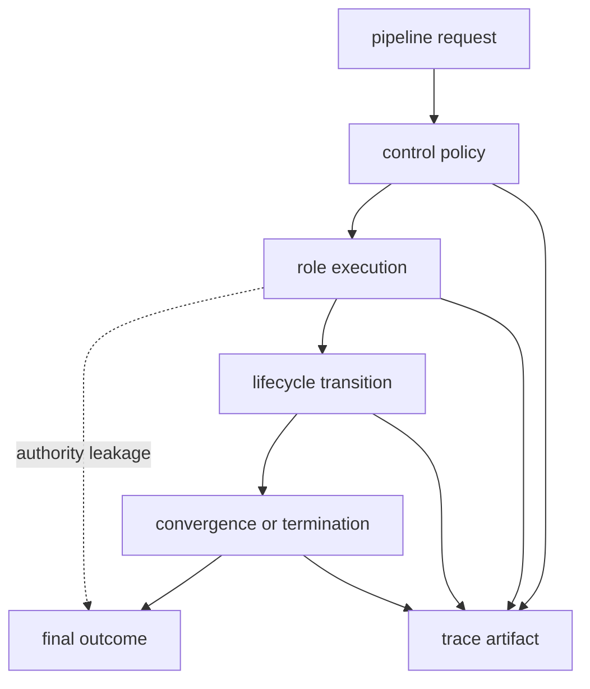
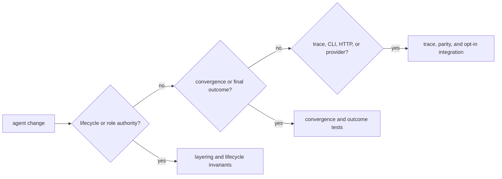

# Risk Register

Agent owns bounded role orchestration: call order, lifecycle, convergence,
termination, and trace evidence. Its risks arise when persuasive role output
quietly acquires authority, or when a final result is separated from the
decisions and failures that produced it.

## Risk Topology

## Active Risks And Controls

| Risk | Consequence | Preventive control | Detection evidence | Residual exposure |
| --- | --- | --- | --- | --- |
| a role prompt or output decides lifecycle policy | model text bypasses reviewable orchestration rules | keep roles passive and transitions in typed control | passive-agent, no-lifecycle-override, kernel, and workflow-graph invariants | prompts can still influence the content presented to policy |
| model, prompt, or configuration identity drifts | traces appear comparable across different executions | retain model metadata, prompt hash, configuration, and replay classification | prompt-hash, defaults-versioning, trace-field, and replayability tests | providers can change behavior behind a stable model name |
| convergence is mistaken for correctness | repeated or oscillating low-quality output is accepted | distinguish strategy, window, score, reason, and terminal limit | convergence strategy, snapshot, oscillation, and outcome tests | convergence metrics depend on chosen signals |
| maximum iterations or interruption is relabeled success | incomplete work appears finalized | typed termination and failure taxonomy | lifecycle, transition, interrupt, failure, and pipeline outcome tests | consumers can ignore status and display only content |
| veto or validation findings disappear | a normally completed call is reported as accepted | preserve decision, issues, and terminal status independently | validator, verifier, key-set, completeness, and final-model tests | external presentation layers can collapse detailed outcomes |
| trace omits or reorders lifecycle evidence | final output cannot be reconstructed or audited | mandatory fields, ordered events, schema version, and canonical hashing | trace ordering, mandatory-field, reconstruction, hash, and schema snapshot tests | observational timestamps remain environment-sensitive |
| result and trace artifacts come from different attempts | a plausible pair describes no actual run | fresh output root and post-write reconstruction comparison | artifact-boundary, CLI, dry-run, and replay-mismatch tests | separate filesystem writes are not one transaction |
| batch summary hides per-file failures | one successful artifact masks incomplete processing | retain typed outcome for every shard or file | shard merging, batch support, failure assembly, and pipeline tests | consumers can retain only the primary artifact |
| provider credentials are loaded too broadly | secrets are exposed to operations that do not need them | isolate secret injection and provider setup | environment, CLI, dry-run, and adapter tests | process environments remain deployment-controlled |
| trace and telemetry expose prompts or source content | observability becomes an ungoverned sensitive record | redact, restrict, and retain according to deployment policy | trace serialization and logging tests | package tests cannot classify the sensitivity of inputs |

## Evidence Routing

A provider change usually takes two routes: deterministic adapter and trace
tests for the owned contract, plus opt-in live evidence for connectivity. Live
tests must not replace lifecycle, failure, or replayability coverage.

## Operational Interpretation

Agent can prove that orchestration followed its declared control and retained
an inspectable trace. It cannot prove that role content is true or that a
converged answer is safe to act upon. Evidence interpretation belongs to reason
and whole-run admission belongs to runtime.

Use [architecture risks](../architecture/architecture-risks.md) for failure
mechanisms, [test strategy](test-strategy.md) for executable evidence, and
[known limitations](known-limitations.md) for unsupported deployment claims.
