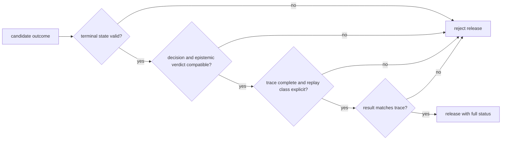

# Risk Register

Agent output is persuasive by design, which makes authority leakage the primary
hazard. A role response must never acquire the ability to approve itself,
rewrite lifecycle policy, hide a veto, or convert an interrupted execution into
success. The final result and trace must describe the same attempt.

## Authority And Evidence Flow

```mermaid
flowchart TD
    policy["typed control policy"] --> call["role call"]
    call --> output["untrusted role output"]
    output --> validation["schema and policy validation"]
    validation --> transition["controlled transition"]
    transition --> terminal["decision and termination"]
    transition --> trace["ordered trace"]
    terminal --> result["final result"]
    trace --> parity{"result-trace parity"}
    result --> parity

    output -. "must not control" .-> transition
```

## Persistent Risks

| Hazard | Severity | Detection signal | Required control | Residual owner |
| --- | --- | --- | --- | --- |
| role text alters lifecycle or approval policy | critical | a transition lacks a typed controller decision or derives authority from free text | keep roles passive; allow only validated control transitions | workflow owner |
| prompt, model, provider, or configuration drifts | high | prompt hash, model metadata, runtime version, or adapter configuration differs | bind complete execution identity to every comparable trace | provider integrator |
| schema-valid model output is treated as factual | critical | content passes type validation but fails evidence or domain review | treat output as untrusted; route truth claims through reason and policy | decision owner |
| convergence is relabeled correctness | critical | accepted content has stability or confidence evidence but no adequacy evidence | preserve convergence semantics separately from epistemic verdict and decision | API consumer |
| maximum iterations, interruption, or exhaustion is relabeled success | critical | termination and stop reasons conflict with displayed status | require typed terminal classification before exposing content | application owner |
| veto, validation issue, or epistemic failure disappears | critical | final result omits issues present in trace or controller state | make result-trace parity a release gate | artifact owner |
| trace omits or reorders lifecycle evidence | high | entries violate order, mandatory fields, schema, or canonical hash | validate trace before finalization and after load | trace owner |
| final result and trace come from different attempts | critical | reconstructed result differs from `final_result.json` | use a fresh output root, stable attempt identity, and post-write comparison | CLI or storage owner |
| schema upgrade silently weakens old evidence | high | an upgraded record defaults a meaning-bearing field without provenance | retain source schema, explicit upgrade mapping, and replay classification | compatibility owner |
| shard or batch summary hides local failures | high | aggregate success coexists with failed or missing shard outcomes | retain an outcome and termination reason per shard; reconcile counts | batch owner |
| retry repeats an external tool effect | critical | more than one attempt uses no idempotency identity for a mutating call | classify retry safety and delegate effects to governed runtime authority | tool integrator |
| broad CLI key validation expands secret exposure | high | offline command fails without unrelated provider keys or receives all keys | isolate process; prefer focused library paths; restrict environment capture | service operator |
| trace or telemetry retains sensitive prompts and source data | critical | artifact or log scan finds restricted input, response, or credentials | allowlist trace fields; redact before persistence; enforce retention policy | data controller |

## Outcome Release Gate



The release payload must include decision, confidence semantics, epistemic
verdict, convergence reason and iterations, stop reason, termination reason,
issues, trace path or identity, runtime version, and replay classification.
Consumers may simplify presentation only if they preserve rejection, refusal,
interruption, and partial states.

## Evidence Required By Change

- Role or prompt changes require passive-agent, schema rejection, prompt/model
  identity, and adversarial-output evidence.
- Lifecycle and controller changes require allowed and forbidden transitions,
  veto, interruption, exhaustion, failure, and terminal-state evidence.
- Convergence changes require stability, confidence, oscillation, window,
  threshold, maximum-iteration, and false-convergence scenarios.
- Trace and result changes require mandatory fields, ordering, canonical hash,
  schema upgrade, reconstruction, missing artifact, and mismatch tests.
- Provider changes require deterministic adapter tests plus opt-in live
  connectivity evidence; live calls cannot replace control-law coverage.
- Shard or batch changes require per-item failure retention, count
  reconciliation, merge conflict, and aggregate-termination evidence.

Agent proves that declared orchestration controls ran and produced inspectable
evidence. Reason owns claim support, runtime owns effect admission, and the host
owns isolation and secrets. None of those responsibilities can be inferred from
a fluent final answer.

See [known limitations](known-limitations.md) for unsupported claims and
[architecture risks](../architecture/architecture-risks.md) for failure
mechanisms.
