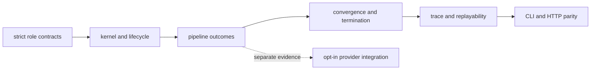

# Test Strategy

Agent tests prove orchestration through contracts, state transitions, trace
evidence, and failure paths. Model quality and provider integration are tested
separately so a live response cannot conceal a broken lifecycle.

## Evidence Layers

Provider contact is deliberately outside the deterministic proof chain. A live
response demonstrates connectivity and adapter behavior; lifecycle and trace
correctness come from controlled tests whose inputs and time can be fixed.

| Test family | Principal claim |
| --- | --- |
| contract and final-model tests | inputs, outputs, confidence, metadata, key sets, and final artifacts retain strict schemas |
| execution-kernel and lifecycle tests | validation, call order, revision, failure, and shutdown follow owned transitions |
| pipeline flow/outcome tests | planning, execution, judgment, verification, finalization, sharding, and failure assembly produce typed outcomes |
| convergence tests | strategies, windows, snapshots, hashes, oscillation, confidence, and termination remain explicit |
| trace tests | mandatory fields, ordering, schema versions, replayability, reconstruction, serialization, and deterministic hashes remain stable |
| agent-specific tests | reader, planner, summarizer, critique, judge, validator, verifier, and stage runner honor passive role boundaries |
| `tests/invariants/` | layering, API isolation, lifecycle ownership, package structure, and public exports do not erode |
| `tests/api/` | CLI and HTTP return equivalent contracts and traces; OpenAPI remains valid and versioned |
| `tests/e2e/` | the canonical pipeline produces complete artifacts with controlled and real-model paths kept distinct |

## High-risk change matrix

| Change | Focused evidence |
| --- | --- |
| lifecycle phase or transition | lifecycle, iteration-transition, workflow-graph, trace-ordering, and architecture snapshot tests |
| agent input/output field | contract, output-schema, final-model, validator-key-set, API contract, and schema snapshot tests |
| convergence strategy | strategy, monitor, snapshot/hash, pipeline outcome, and termination tests |
| trace field or serialization | mandatory-field, serialization, schema-version, hash-consistency, reconstruction, and replay-mismatch tests |
| provider adapter | adapter/runtime tests, then opt-in live integration for that provider |
| CLI configuration or artifacts | CLI smoke/main tests, dry-run trace, examples golden files, and CLI/HTTP parity |
| pipeline layer boundary | import/layering invariants and application workflow graph tests |

## Snapshot discipline

Snapshots protect durable external shapes: architecture contracts, default
versions, agent-kernel behavior, trace schema, and representative examples.
Review a snapshot change semantically. Regenerating expected data without
explaining a removed field, changed transition, or new default would erase the
signal the snapshot is designed to provide.

## Replay evidence

Deterministic trace tests freeze time or exclude observational timestamps,
construct complete model and replay metadata, and compare canonical serialized
hashes. Negative tests remove required metadata, introduce non-zero
temperature, alter trace content, or change schema versions and require a
specific refusal or mismatch.

Replay tests establish artifact coherence. Live model tests establish that an
adapter can contact its provider and records the returned metadata. Neither is
a substitute for evaluating model correctness on representative work.

## Regression standard

Reproduce a defect at the narrowest owned layer—contract, role, lifecycle,
convergence, trace, or interface. Add a pipeline-level test when the defect
changes final status or artifact completeness. Add parity coverage when CLI
and HTTP could interpret the same request differently, and add a live test only
when the defect is specific to an external provider boundary.

## Claims Outside The Test Boundary

The suite does not establish that a model is truthful, safe, unbiased, or fit
for a decision; that a convergence score implies correctness; or that a
provider will reproduce a response. Those claims require declared evaluation
data, provider and model identity, policy review, and retained production
evidence beyond orchestration tests.
