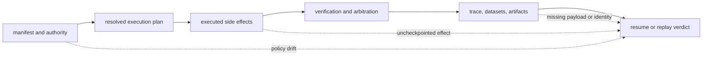
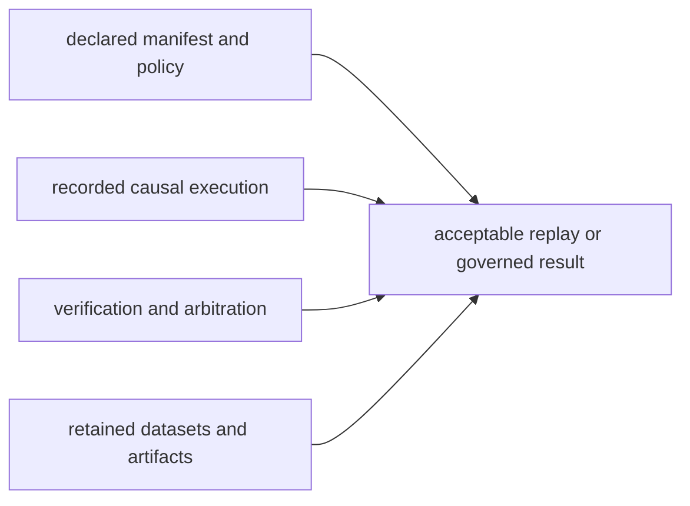

# Architecture Risks

Runtime sits where declared policy becomes side effects and retained evidence.
Its most serious risks are therefore false authority: a run can look complete,
replayable, or verified while an important identity, decision, or effect lived
outside the recorded boundary.

## Authority Failure Paths

Resume and replay are authority decisions, not file-loading conveniences. A
missing identity or unrecorded effect narrows what runtime can claim even when
the stored trace remains readable.

## Authority And Policy Drift

A resumed or replayed run must retain tenant, manifest, plan, dataset,
environment, verification policy, and store identity. Continuing under changed
authority joins two different contracts into one history. The runtime rejects
that condition; deployments should create a new run and compare the two
histories explicitly.

`unsafe` is also an authority boundary, not a synonym for live execution. It
records relaxed semantics and a finalized trace, but it does not satisfy live
mode's verification-coverage contract. Downstream systems that discard the
mode or `non_certifiable` state can accidentally promote an unsafe result.

## Dataset And Artifact Drift

Dataset names are not identity. Version, state, hash, and storage reference
must travel together from planning through replay. Mutable remote content,
expired credentials, or a reused location can make an old descriptor resolve
to different bytes.

The execution store retains artifact metadata and causal relationships. An
external artifact store may retain the payload itself. Losing that payload—or
accepting a payload whose bytes no longer match its hash—leaves a trace that is
structurally readable but cannot support the original evidence claim.

## Nondeterminism Hidden From The Envelope

Seeds and entropy budgets govern recorded sources of variance. They cannot
control provider model changes, wall clocks, parallel hardware, mutable remote
services, or unversioned tools unless those influences are captured in the
replay envelope and event stream. Underreported entropy creates stronger replay
claims than the evidence supports.

Bounded replay is especially easy to overstate. Allowed semantic variance must
be declared by the original manifest and evaluated by the replay policy; it
cannot be invented after observing a difference.

## Verification Mistaken For Truth

Verification proves that registered rules evaluated their recorded inputs.
Arbitration proves that a declared policy handled those results. Neither proves
factual truth, completeness of the rule set, model calibration, or fitness for
an unstated use. Permissive arbitration and missing evidence must remain
visible in the final result rather than being flattened into a generic success.

## Persistence Beyond Its Guarantees

DuckDB is a guarded single-writer audit and replay store. Removing its lock to
admit a second writer risks corrupting causal ordering and checkpoint identity.
Copying only selected tables or editing rows manually can preserve readable SQL
while breaking the schema contract required for replay.

Database commits do not transact external side effects. A host can fail after
a provider call and before its checkpoint, or after a checkpoint and before a
caller observes success. Executors that cannot deduplicate or compensate such
actions make recovery unsafe.

Finalized traces are immutable. Mutating a terminal event, appending new causal
history, or reclassifying a completed run in place destroys the value of the
trace as evidence. Corrections belong in a new linked run or an independently
auditable record.

## Tenant And Secret Exposure

Tenant identifiers in manifests and rows do not enforce isolation. Filesystem,
database, process, and artifact-store permissions remain deployment
responsibilities. Traces can contain retrieved content, reasoning, tool input,
provider metadata, and failure details; credentials and unrestricted sensitive
payloads must not be placed in them.

## Interface Overclaim

A versioned HTTP schema communicates a contract shape, not endpoint
availability. Health and readiness are implemented; run and replay currently
return `501`. Building a remote execution integration around those schemas
alone creates an architectural dependency on behavior that does not exist.

Compatibility packages carry names and entry points, not independent runtime
semantics. Divergent behavior added to an alias would split authority and make
the canonical trace contract ambiguous.

## Operational Interpretation

The strongest runtime claim is always bounded by retained evidence:

If one input is absent, the appropriate outcome is a narrower claim or a
refusal—not a reconstructed success. The [known limitations](../quality/known-limitations.md)
describe the corresponding operator boundaries, and
[State and Persistence](state-and-persistence.md) defines what the local store
does and does not retain.
