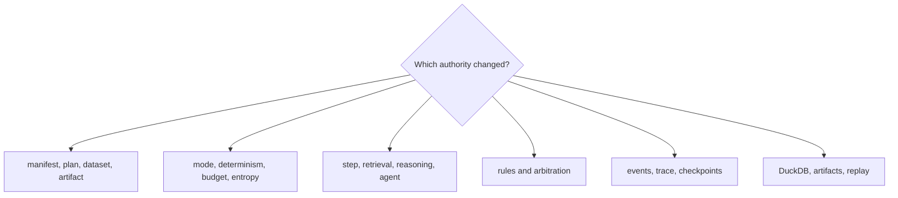

# Code Navigation

Navigate runtime by the authority boundary that accepted or refused state.
Begin with the contract, follow planning and mode preparation, inspect the
executor and verifier, then end at trace finalization and typed persistence.

## Navigate by concern

| Concern | Begin in | Continue in | Evidence family |
| --- | --- | --- | --- |
| flow, step, dataset, artifact, or compatibility shape | `contracts/` and matching `model/` area | planner and interface loaders | contract/model tests and golden plan |
| plan order or environment identity | `application/planner.py` | flow preparation and observability capture | dependency, environment, fingerprint tests |
| run mode or authority context | execution policy/preparation and `runtime/context.py` | determinism guard, budget, authority | strategy and strict-mode tests |
| step, retrieval, reasoning, or agent behavior | matching executor in `runtime/execution/` | lifecycle step operations and event recording | focused executor plus end-to-end flow tests |
| event order or checkpoint | event causality, trace recorder, lifecycle recording | state tracker and execution persistence | causality, resume, partial-failure, crash tests |
| nondeterminism or entropy | model policy/artifact types and application lifecycle | observability classification and store | entropy canary, budget, replay tests |
| verification rule or contradiction | `verification/` and `model/verification/` | lifecycle step verification and finalization | rule, arbitration, content, failure tests |
| DuckDB schema or round trip | `observability/storage/` and migrations | execution persistence and replay store | migration, smoke, hostile-store, cross-process tests |
| artifact payload or lineage | artifact contract and `runtime/artifact_store.py` | persisted artifact edges | hostile store, lineage, compatibility tests |
| replay verdict or drift | application replay modules | `observability/analysis/` | equivalence, fuzz, policy, dataset, temporal drift tests |
| CLI command behavior | `interfaces/cli/` | manifest/policy loaders and result rendering | CLI-focused contract tests |
| HTTP contract | `api/v1/` | checked-in schema and readiness store | schema stability and HTTP contract tests |

Paths are relative to
`packages/bijux-canon-runtime/src/bijux_canon_runtime/` unless stated otherwise.

## Follow one governed run

1. Load the manifest, dataset, and policy contracts.
2. Follow resolution into the immutable execution plan and fingerprints.
3. Inspect mode preparation, authority context, store registration, and resume
   state.
4. Follow each step through its lower-layer executor and causal recorder.
5. Inspect verification results separately from arbitration.
6. Follow trace finalization into execution-store projections and artifact
   payload storage.
7. For replay, start again from the retained envelope and compare the verdict
   and reason, not only command completion.

## Durable landmarks

| Landmark | Why it matters |
| --- | --- |
| `application/execute_flow.py` | public application authority entry |
| `runtime/execution/lifecycle/` | preparation, ordered execution, verification, recording, finalization |
| `observability/schema.sql` and migrations | durable normalized storage contract |
| `observability/schema.hash` | active storage schema identity |
| `tests/regression/test_crash_recovery.py` | interruption and resume boundary |
| replay regression family | envelope, policy, dataset, process, fuzz, and acceptability evidence |

Place a regression at the authority layer that should have refused the state.
Add end-to-end evidence when an invalid `FlowRunResult` could escape, and replay
evidence whenever a changed field participates in retained identity.
