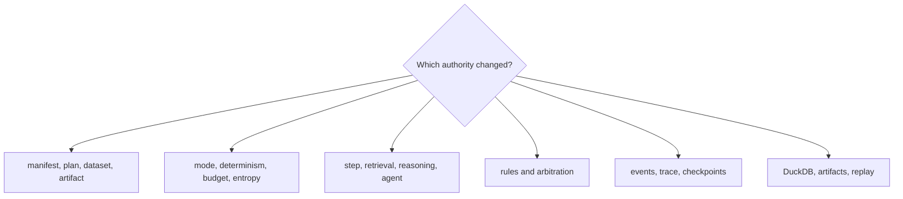

# Code Navigation

Navigate runtime by the authority boundary that accepted or refused state.
Begin with the contract, follow planning and mode preparation, inspect the
executor and verifier, then end at trace finalization and typed persistence.

## Navigate by concern

| Concern | Begin in | Continue in | Evidence family |
| --- | --- | --- | --- |
| flow, step, dataset, artifact, or compatibility shape | `contracts/` and matching `model/` area | planner and interface loaders | contract/model tests and golden plan |
| plan order or environment identity | `application/planner.py` | flow preparation and observability capture | dependency, environment, fingerprint tests |
| run mode or authority context | execution policy/preparation and `runtime/context.py` | determinism guard, budget, authority | strategy and strict-mode tests |
| step, retrieval, reasoning, or agent behavior | matching executor in `runtime/execution/` | lifecycle step operations and event recording | focused executor plus end-to-end flow tests |
| event order or checkpoint | event causality, trace recorder, lifecycle recording | state tracker and execution persistence | causality, resume, partial-failure, crash tests |
| nondeterminism or entropy | model policy/artifact types and application lifecycle | observability classification and store | entropy canary, budget, replay tests |
| verification rule or contradiction | `verification/` and `model/verification/` | lifecycle step verification and finalization | rule, arbitration, content, failure tests |
| DuckDB schema or round trip | `observability/storage/` and migrations | execution persistence and replay store | migration, smoke, hostile-store, cross-process tests |
| artifact payload or lineage | artifact contract and `runtime/artifact_store.py` | persisted artifact edges | hostile store, lineage, compatibility tests |
| replay verdict or drift | application replay modules | `observability/analysis/` | equivalence, fuzz, policy, dataset, temporal drift tests |
| CLI command behavior | `interfaces/cli/` | manifest/policy loaders and result rendering | CLI-focused contract tests |
| HTTP contract | `api/v1/` | checked-in schema and readiness store | schema stability and HTTP contract tests |

Paths are relative to
`packages/bijux-canon-runtime/src/bijux_canon_runtime/` unless stated otherwise.

## Follow one governed run

1. Load the manifest, dataset, and policy contracts.
2. Follow resolution into the immutable execution plan and fingerprints.
3. Inspect mode preparation, authority context, store registration, and resume
   state.
4. Follow each step through its lower-layer executor and causal recorder.
5. Inspect verification results separately from arbitration.
6. Follow trace finalization into execution-store projections and artifact
   payload storage.
7. For replay, start again from the retained envelope and compare the verdict
   and reason, not only command completion.

## Diagnose from retained evidence

| Symptom | Inspect first | Follow into | Evidence that closes the diagnosis |
| --- | --- | --- | --- |
| plan hash changes unexpectedly | manifest, dataset, dependency and environment fingerprints | planner and preparation support | field-level identity difference with a new golden plan |
| run mode performs too much or too little work | mode and authority context | execution policy, preparation and lifecycle | admitted operations match the selected mode |
| events are missing or duplicated | event identifiers and causal parents | recorder, lifecycle recording and persistence | one causally ordered event history for the run |
| an effect repeats after recovery | effect receipt, checkpoint and resume cursor | executor and recovery path | idempotent disposition tied to the original attempt |
| verification evidence is overwritten | immutable findings and artifact identity | rule execution then arbitration | findings remain intact while policy records a separate verdict |
| partial DuckDB state appears complete | schema version, run status and finalization record | migrations, store transaction and lifecycle finalization | incomplete state is refused or remains explicitly non-terminal |
| artifact metadata exists without payload | artifact identity and storage locator | artifact store and persisted lineage edge | payload hash resolves or the run is reported incomplete |
| replay passes despite drift | replay envelope and semantic trace diff | replay support and acceptability policy | every accepted difference is named by retained policy |
| HTTP reports a completed run | response status and operation contract | `api/v1/` handler | run/replay remains an explicit `501`, never fabricated execution |
| canonical integration fails after import | loader purpose, module and required callable | `runtime/execution/integration_loaders.py` and package root exports | callable contract resolves or a stable integration error names the gap |

Keep seam tests that substitute a callable separate from installed-package
integration tests. The former proves executor behavior; only the latter proves
that the canonical packages compose through their published roots.

## Place changes at the authority owner

| Desired change | Primary location | Required proof expansion |
| --- | --- | --- |
| manifest, plan, dataset, artifact or policy field | matching `model/` and `contracts/` area | immutability, strict validation, identity and serialization |
| plan resolution or preparation rule | `application/` | golden plan, determinism, mode and environment evidence |
| executor or effect behavior | `runtime/execution/` | authority, ordering, receipts, failure and recovery cases |
| verification rule or arbitration policy | `verification/` and `model/verification/` | immutable finding, contradiction and verdict evidence |
| event, trace, schema or replay analysis | `observability/` | causality, migration, hostile-store and semantic-diff cases |
| CLI operation | `interfaces/cli/` | application result, exit code and rendering contract |
| HTTP operation | `api/v1/` | OpenAPI, headers, failure envelope and behavioral readiness |

If an interface needs new execution behavior, add it behind the application
authority and expose the same semantics to every supported interface. If a
recorder or store needs to decide whether work continues, move that decision
back to execution or verification and retain observability as evidence.

## Durable landmarks

| Landmark | Why it matters |
| --- | --- |
| `application/execute_flow.py` | public application authority entry |
| `runtime/execution/lifecycle/` | preparation, ordered execution, verification, recording, finalization |
| `observability/schema.sql` and migrations | durable normalized storage contract |
| `observability/schema.hash` | active storage schema identity |
| `tests/regression/test_crash_recovery.py` | interruption and resume boundary |
| replay regression family | envelope, policy, dataset, process, fuzz, and acceptability evidence |

Place a regression at the authority layer that should have refused the state.
Add end-to-end evidence when an invalid `FlowRunResult` could escape, and replay
evidence whenever a changed field participates in retained identity.
