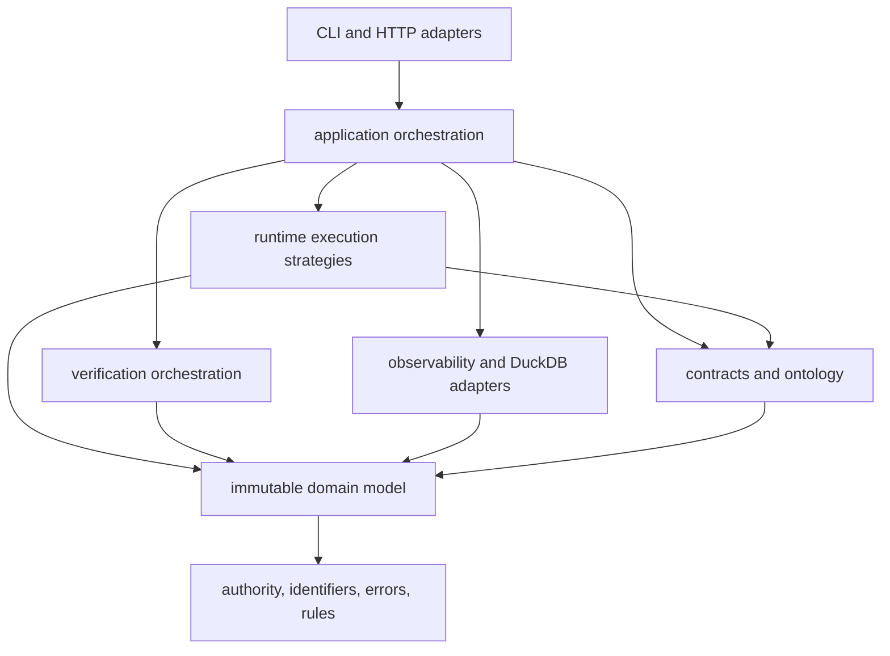

# Dependency Direction

`bijux-canon-runtime` is the outer execution authority for a canon flow. Its
dependencies point from durable contracts toward orchestration, execution,
persistence, and delivery. That direction keeps a `FlowManifest` intelligible
without a database, command parser, HTTP process, or concrete executor.



## The inward boundary

`core`, `ontology`, `contracts`, and `model` describe authority, identity,
manifests, plans, datasets, artifacts, policies, traces, and verification
records. They must remain usable as values and rules. They do not load files,
open DuckDB, parse command lines, call agents, or choose a runtime mode from
ambient configuration.

This boundary is what makes planning reviewable. A plan can be resolved and
hashed before execution resources exist, and plan mode can return without
allocating a run identifier or mutable trace.

## Orchestration and execution

`application` owns complete use cases: resolve, prepare, execute, persist,
resume, and replay. It may coordinate the inner contracts with runtime and
storage capabilities, but it does not hide those capabilities behind global
state. A non-plan execution therefore receives a write store, policy, and
execution resources explicitly.

`runtime.execution` implements step ordering and mode-specific behavior. Its
executors consume resolved plans and authority-bearing contexts. They may emit
artifacts, evidence, reasoning, tool events, and verification inputs; they may
not redefine the plan contract or append directly to an already finalized
trace.

Verification is a sibling execution concern, not a property of an executor.
`verification` evaluates declared rules and arbitration policy over recorded
inputs. It must not call an agent to manufacture missing evidence or mutate the
artifact whose integrity it is deciding.

## Adapters at the edge

`observability.capture`, `observability.storage`, and
`observability.analysis` adapt runtime values to clocks, traces, DuckDB, and
comparison reports. The domain model does not import those adapters. Read and
write storage capabilities are separate so inspection cannot acquire mutation
authority accidentally.

`interfaces.cli` and `api.v1` translate caller input into application calls.
They may select configured adapters and render results, but they do not own
execution semantics. Compatibility distributions forward the canonical import
and command surfaces; they do not introduce a second implementation.

## Cross-package direction

Ingest, index, reason, and agent produce governed inputs consumed by runtime.
Runtime composes those contracts and records their use. It does not absorb
their normalization, retrieval, claim-construction, or role-lifecycle rules.
Conversely, those packages do not depend on runtime persistence or replay in
order to define their own outputs.

The durable direction is:

```text
ingest / index / reason / agent contracts
                    -> runtime manifest and plan
                    -> governed execution
                    -> retained trace and replay verdict
```

See the [module map](module-map.md) for concrete ownership and the
[execution model](execution-model.md) for the lifecycle built on this
dependency structure.
