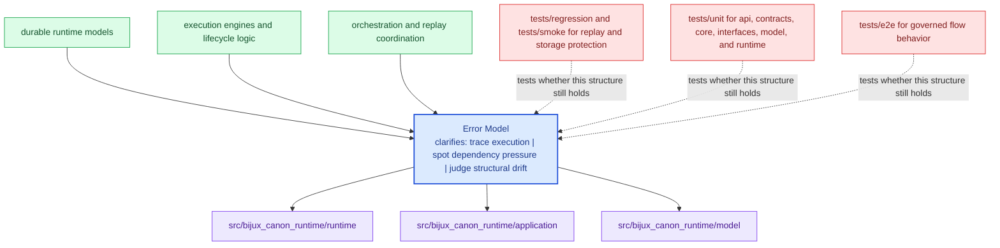

# Error Model

The package error model should make it clear which failures are local validation issues,
which are dependency failures, and which are contract violations.

Good error explanations reduce two kinds of waste at once: operator confusion in
the moment and architectural confusion during later review. The package should
fail in ways that still preserve the boundary story.

Treat the architecture pages for `bijux-canon-runtime` as a reviewer-facing map of structure and flow. They should shorten code reading, not try to replace it.

## Visual Summary

## Review Anchors

- inspect interface modules for operator-facing error shape
- inspect application and domain modules for orchestration failures
- inspect tests for the failure cases the package already protects

## Test Areas

- tests/unit for api, contracts, core, interfaces, model, and runtime
- tests/e2e for governed flow behavior
- tests/regression and tests/smoke for replay and storage protection
- tests/golden for durable example fixtures

## Concrete Anchors

- `src/bijux_canon_runtime/model` for durable runtime models
- `src/bijux_canon_runtime/runtime` for execution engines and lifecycle logic
- `src/bijux_canon_runtime/application` for orchestration and replay coordination

## Use This Page When

- you are tracing structure, execution flow, or dependency pressure
- you need to understand how modules fit before refactoring
- you are reviewing design drift rather than one isolated bug

## Decision Rule

Use `Error Model` to decide whether a structural change makes `bijux-canon-runtime` easier or harder to explain in terms of modules, dependency direction, and execution flow. If the change works only because the design becomes harder to read, the safer answer is redesign rather than acceptance.

## What This Page Answers

- how `bijux-canon-runtime` is organized internally in terms a reviewer can follow
- which modules carry the main execution and dependency story
- where structural drift would show up before it becomes expensive

## Reviewer Lens

- trace the described execution path through the named modules instead of trusting the diagram alone
- look for dependency direction or layering that now contradicts the documented seam
- verify that the structural risks named here still match the current code shape

## Honesty Boundary

This page describes the current structural model of `bijux-canon-runtime`, but it does not guarantee that every import path or runtime path still obeys that model. Readers should treat it as a map that must stay aligned with code and tests, not as an authority above them.

## Next Checks

- move to interfaces when the review reaches a public or operator-facing seam
- move to operations when the concern becomes repeatable runtime behavior
- move to quality when you need proof that the documented structure is still protected

## Purpose

This page records how to reason about failures in architecture review.

## Stability

Keep it aligned with the actual error-handling behavior and tests.
