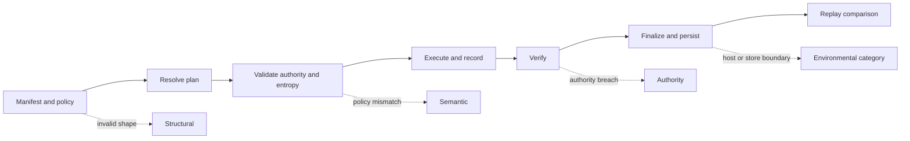
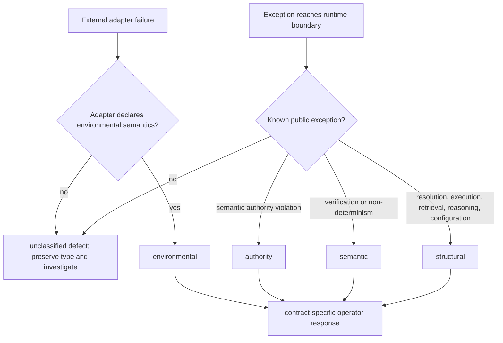

# Error Model

`bijux-canon-runtime` classifies failures by the contract they violate, not by
the component that happened to raise them. This keeps operator response stable
across planning, execution, persistence, verification, and replay.

```mermaid
flowchart LR
    A[Manifest and policy] --> B[Resolve plan]
    B --> C[Validate authority and entropy]
    C --> D[Execute and record]
    D --> E[Verify]
    E --> F[Finalize and persist]
    F --> G[Replay comparison]
    A -. invalid shape .-> H[Structural]
    C -. policy mismatch .-> I[Semantic]
    E -. authority breach .-> J[Authority]
    F -. host or store boundary .-> K[Environmental category]
```

## Stable failure classes

| Class | Examples | Operator response |
| --- | --- | --- |
| `structural` | manifest resolution, execution shape, retrieval, reasoning, or configuration failure | correct the contract or implementation input |
| `semantic` | verification failure or undeclared non-determinism | review policy, entropy declarations, and evidence |
| `environmental` | reserved for unavailable storage or an external runtime dependency; the current core exception map assigns no exception to this class | classify at the adapter boundary, then restore the environment without changing the declared contract |
| `authority` | finalized-trace mutation, invalid provenance, or another semantic authority breach | stop and investigate; do not retry as ordinary infrastructure noise |

The public exception taxonomy includes `ResolutionFailure`,
`ExecutionFailure`, `RetrievalFailure`, `ReasoningFailure`,
`VerificationFailure`, `NonDeterminismViolationError`,
`SemanticViolationError`, and `ConfigurationError`. Known exceptions map to a
stable class. The current map covers structural, semantic, and authority
failures; environmental classification remains an adapter responsibility. An
unknown exception is deliberately not guessed into a class.

## Classification Is an Assertion

Classification states which public contract was violated; it is not a generic
exception wrapper. The current map is intentionally closed.

```mermaid
flowchart TD
    failure[Exception reaches runtime boundary] --> known{Known public exception?}
    known -->|no| unknown[unclassified defect; preserve type and investigate]
    known -->|resolution, execution, retrieval, reasoning, configuration| structural[structural]
    known -->|verification or non-determinism| semantic[semantic]
    known -->|semantic authority violation| authority[authority]
    adapter[External adapter failure] --> declared{Adapter declares environmental semantics?}
    declared -->|yes| environmental[environmental]
    declared -->|no| unknown
    structural --> response[contract-specific operator response]
    semantic --> response
    authority --> response
    environmental --> response
```

`classify_failure` raises for an unknown exception rather than manufacturing a
stable category. An adapter that introduces environmental classification must
retain the failing dependency and its operation; otherwise operators cannot
distinguish restoration of infrastructure from changing the flow contract.

## Refusal points

Execution refuses to start when the caller supplies both a manifest and a
resolved plan, supplies neither, omits the determinism level, lacks a required
execution store, or omits verification policy for live, observe, or unsafe
execution. Contract validation also rejects mismatched tenants, undeclared or
out-of-policy entropy, non-reachable dependency graphs, invalid dataset state,
and deprecated datasets without explicit permission.

Budgets fail closed when step, token, artifact, per-step artifact, evidence, or
trace-event limits are exceeded. Trace recording is append-only and requires
the runtime authority token; a finalized trace cannot be mutated or returned as
an unfinished execution result.

## Failure State and Recovery

The exception class and durable execution state answer separate questions.

| State at failure | Evidence that remains authoritative | Permitted next action |
| --- | --- | --- |
| preparation refused | validated inputs and the explicit refusal; no execution claim | repair configuration or policy, then prepare again |
| registered run interrupted | persisted steps, events, artifacts, evidence, invocations, entropy, claims, and checkpoint | resume that run through the read-store contract |
| execution terminated by governed failure | trace events and failure evidence up to termination | inspect classification; retry only under package and adapter policy |
| semantic finalization refused | finalized execution evidence plus the semantic violation | preserve for diagnosis; do not persist as a valid completed result |
| run finalized and persisted | immutable trace authority and run record | replay or compare; never reopen for mutation |

Resume is valid only for retained partial state whose tenant and run identity
match the resolved plan. It loads the last completed step and continues event
indexes after persisted history. Retrying without that state creates a new run
and must not reuse the prior run's authority claim.

## CLI and replay behavior

The CLI uses exit status `1` for classified execution failure and `2` for
configuration-contract violations or replay differences. A replay diff is
structured evidence: it can identify plan, environment, tenant, dataset,
artifact, evidence, or verification-policy divergence. Do not reduce it to a
generic retry.

The HTTP API returns structural envelopes for parse and validation failures and
authority envelopes when required governance headers are absent or invalid.
Flow run and replay endpoints currently return `501`; that response is a
capability boundary, not a transient execution failure.

Replay differences are not classified as runtime crashes. They are comparison
evidence evaluated against the replay envelope and policy. The original run
remains immutable whether the comparison passes, exceeds allowed variance, or
finds an identity mismatch.
