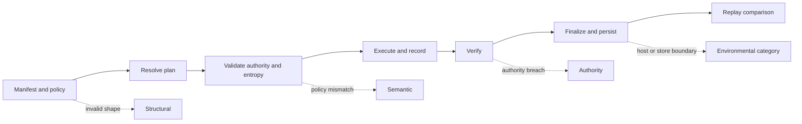

# Error Model

`bijux-canon-runtime` classifies failures by the contract they violate, not by
the component that happened to raise them. This keeps operator response stable
across planning, execution, persistence, verification, and replay.

```mermaid
flowchart LR
    A[Manifest and policy] --> B[Resolve plan]
    B --> C[Validate authority and entropy]
    C --> D[Execute and record]
    D --> E[Verify]
    E --> F[Finalize and persist]
    F --> G[Replay comparison]
    A -. invalid shape .-> H[Structural]
    C -. policy mismatch .-> I[Semantic]
    E -. authority breach .-> J[Authority]
    F -. host or store boundary .-> K[Environmental category]
```

## Stable failure classes

| Class | Examples | Operator response |
| --- | --- | --- |
| `structural` | manifest resolution, execution shape, retrieval, reasoning, or configuration failure | correct the contract or implementation input |
| `semantic` | verification failure or undeclared non-determinism | review policy, entropy declarations, and evidence |
| `environmental` | reserved for unavailable storage or an external runtime dependency; the current core exception map assigns no exception to this class | classify at the adapter boundary, then restore the environment without changing the declared contract |
| `authority` | finalized-trace mutation, invalid provenance, or another semantic authority breach | stop and investigate; do not retry as ordinary infrastructure noise |

The public exception taxonomy includes `ResolutionFailure`,
`ExecutionFailure`, `RetrievalFailure`, `ReasoningFailure`,
`VerificationFailure`, `NonDeterminismViolationError`,
`SemanticViolationError`, and `ConfigurationError`. Known exceptions map to a
stable class. The current map covers structural, semantic, and authority
failures; environmental classification remains an adapter responsibility. An
unknown exception is deliberately not guessed into a class.

## Refusal points

Execution refuses to start when the caller supplies both a manifest and a
resolved plan, supplies neither, omits the determinism level, lacks a required
execution store, or omits verification policy for live, observe, or unsafe
execution. Contract validation also rejects mismatched tenants, undeclared or
out-of-policy entropy, non-reachable dependency graphs, invalid dataset state,
and deprecated datasets without explicit permission.

Budgets fail closed when step, token, artifact, per-step artifact, evidence, or
trace-event limits are exceeded. Trace recording is append-only and requires
the runtime authority token; a finalized trace cannot be mutated or returned as
an unfinished execution result.

## CLI and replay behavior

The CLI uses exit status `1` for classified execution failure and `2` for
configuration-contract violations or replay differences. A replay diff is
structured evidence: it can identify plan, environment, tenant, dataset,
artifact, evidence, or verification-policy divergence. Do not reduce it to a
generic retry.

The HTTP API returns structural envelopes for parse and validation failures and
authority envelopes when required governance headers are absent or invalid.
Flow run and replay endpoints currently return `501`; that response is a
capability boundary, not a transient execution failure.
