# Execution Model

`bijux-canon-runtime` is the authority boundary for governed flow execution. It
resolves a manifest into a plan, enforces determinism and verification policy,
records entropy and provenance, freezes the trace, and persists a replayable
run.

```mermaid
flowchart LR
    manifest["FlowManifest"]
    planner["resolve execution plan"]
    prepare["validate mode, policy, environment, budget"]
    register["register dataset and run"]
    execute["mode-specific execution"]
    verify["verification + arbitration"]
    freeze["finalize immutable trace"]
    semantics["enforce runtime semantics"]
    persist["append-only execution store"]

    manifest --> planner --> prepare --> register --> execute --> verify --> freeze --> semantics --> persist
```

## Manifest Authority

The manifest names the flow and tenant, lifecycle state, determinism level,
replay mode and acceptability, entropy budget, replay envelope, dataset,
agents, dependencies, retrieval contracts, verification gates, and policy for
deprecated data. Non-deterministic intent and allowed variance are explicit
rather than inferred from tool behavior.

Preparation accepts either a manifest or an already resolved plan, never both.
Determinism level must be explicit. Resolving a manifest fingerprints the
environment, normalizes execution steps, and produces the plan hash used by
replay.

## Execution Modes

| Mode | Purpose | Persistence and proof semantics |
| --- | --- | --- |
| `plan` | resolve and inspect | returns the plan without a run ID or trace |
| `dry-run` | execute without live side effects | records simulated events and persists trace evidence |
| `live` | authoritative execution | requires verification policy and complete step verification |
| `observe` | execute with observer verification | retains observed results and arbitration evidence |
| `unsafe` | explicitly relaxed operation | emits a semantic warning and still requires a finalized trace |

`dry-run` and `unsafe` are named modes, not hidden flags. Relaxed determinism or
permissive verification produces a warning event inside the trace.

## Preparation and Resume

Non-plan execution requires a write store. Preparation registers the dataset,
begins or resumes the run, restores persisted events, artifacts, evidence, tool
invocations, entropy use, claims, and the last checkpoint, then assigns new
indexes after the restored values.

Planning and execution can restart from retained state. Dataset registration,
run creation, persisted appends, and finalization are irreversible boundaries.
The runtime therefore resumes from the last completed action instead of
replaying an untracked partial write.

## Governed Execution

Execution strategies receive a resolved plan and an authority-bearing context.
Only the runtime authority can append trace events through the recorder. The
result contains the plan, finalized trace, artifacts, retrieved evidence,
reasoning bundles, verification results, arbitration decisions, and run ID.

Live semantics require exactly one verification outcome per reasoning action,
unless a recorded retrieval, reasoning, or action failure terminates that path.
Verification evaluates claim/evidence linkage, confidence, content hashes,
configured rules, randomness constraints, and rule-cost budgets. Arbitration
records the policy fingerprint, engines, statuses, targets, and final decision.

## Finalization

The trace must be finalized before it can leave execution. Finalization makes
the trace unreadable while mutable and prevents a second finalization. Runtime
semantic checks run before persistence; a structurally invalid result cannot be
converted into an apparently complete database record.

The store persists mode-specific event data and final trace authority. Replay
loads that retained trace, dataset descriptor, and replay envelope, executes the
resolved plan again, and evaluates structural and entropy differences under the
manifest's replay policy.

See [Artifact Contracts](../interfaces/artifact-contracts.md) for retained
authority and [Failure Recovery](../operations/failure-recovery.md) for restart
and replay handling.
