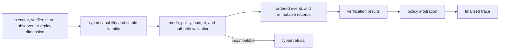

# Extensibility Model

Runtime extensions operate inside an authority system. An executor, verifier,
store, observer, or replay comparison is compatible only when it preserves
manifest authority, causal ordering, immutable evidence, policy arbitration,
and explicit refusal.

## Extension path

No extension writes final authority directly. It contributes evidence that the
application lifecycle validates, records, verifies, arbitrates, and freezes.

## Executor extensions

Step and lower-package executors receive a resolved step plus bounded runtime
context. A new executor must:

- accept only declared authority, mode, tenant, dataset, budget, and policy;
- emit typed results, tool events, entropy use, artifacts, evidence, claims,
  and failures through the runtime recording path;
- preserve causal parentage and stable producer identities;
- stop at budget or authority refusal rather than silently degrade;
- define retry, timeout, idempotency, cancellation, and compensation behavior
  for external effects;
- avoid direct finalization, arbitration, or ad hoc database writes.

An external API call or file write occurs outside DuckDB's transaction. Use an
idempotency key derived from stable run/step identity and retain the external
operation reference needed to reconcile or compensate it.

## Verification extensions

`VerificationEngine` and `FlowVerificationEngine` implementations return
immutable typed results. They declare engine identity, deterministic posture,
phase, applied and violated rules, checked artifacts, status, reason, and
decision. Verification must not invoke agents, mutate artifacts, or choose the
final policy result.

`VerificationOrchestrator` applies the fingerprinted policy and records a
separate arbitration. Adding an engine, rule, severity, quorum behavior, or
arbitration rule changes acceptance meaning and requires contract and replay
coverage.

## Storage extensions

An execution-store implementation must honor separate read and write
protocols, tenant-qualified lookup, stable ordering, checkpoint/resume state,
finalization immutability, migration identity, and schema-contract hashing. It
must reconstruct the same typed replay projection or refuse unsupported state.

An artifact store owns payload custody behind immutable artifact records. It
must verify content identity and tenant scope and must not treat an artifact ID
alone as integrity evidence.

## Observer extensions

Observers receive runtime events for telemetry or integration. They cannot
change the event, trace, verdict, budget, or lifecycle. Define whether observer
failure is isolated or execution-fatal, and keep exported telemetry correlated
by stable run and step identity without leaking secrets.

## Replay extensions

A new replay comparison dimension joins the replay envelope, diff model, and
acceptability decision. Define canonical comparison, blocking versus bounded
differences, missing-data behavior, and non-certifiable outcomes. A permissive
policy cannot promote a structurally invalid or non-certifiable run.

New execution modes are not ordinary plugins: a mode changes which authority
may execute, observe, persist, or accept work. It requires a complete lifecycle,
configuration, safety, artifact, and replay contract.

The [execution model](execution-model.md) defines final authority. The
[artifact contract](../interfaces/artifact-contracts.md) defines persistence
and replay obligations for every extension.
