# Architecture

Open this section when the question is structural: where run authority lives, how acceptance and persistence flow through the package, and how runtime stays narrower than “whatever happens last.”

## Structural Shape

Runtime architecture is the authority layer above lower-package work. Contracts
describe what a run may contain, execution modules resolve and run steps,
policy modules decide how nondeterminism and budgets are handled, observability
captures durable evidence, and verification turns traces into acceptability
decisions.

```mermaid
flowchart LR
    contracts["contracts<br/>flow, step, dataset, artifact"]
    model["execution model<br/>plans, traces, run modes, verdicts"]
    execution["runtime execution<br/>step, retrieval, reasoning, agent executors"]
    policy["policy and authority<br/>budget, nondeterminism, acceptance"]
    observability["observability<br/>capture, storage, analysis"]
    verification["verification<br/>rules, arbitration, contradictions"]
    verdict["governed run<br/>accepted, rejected, replayable"]

    contracts --> model --> execution --> policy --> verification --> verdict
    execution --> observability --> verification
    policy -. records decisions .-> observability

    classDef page fill:#eef6ff,stroke:#2563eb,color:#153145,stroke-width:2px;
    classDef positive fill:#eefbf3,stroke:#16a34a,color:#173622;
    classDef anchor fill:#f4f0ff,stroke:#7c3aed,color:#47207f;
    classDef action fill:#fff4da,stroke:#d97706,color:#6b3410;
    class contracts page;
    class model,execution,policy,verification positive;
    class observability anchor;
    class verdict action;
```

## Read These First

- open [Module Map](https://bijux.io/bijux-canon/06-bijux-canon-runtime/architecture/module-map/) first when you need the owning code area for a runtime authority concern
- open [Execution Model](https://bijux.io/bijux-canon/06-bijux-canon-runtime/architecture/execution-model/) when you need the real path from lower-package output to governed run artifact
- open [Integration Seams](https://bijux.io/bijux-canon/06-bijux-canon-runtime/architecture/integration-seams/) when a change could blur lower-package semantics with final authority

## Structural Risk

The main architectural risk here is broadening runtime until execution order replaces explicit authority design.

## First Proof Check

- `packages/bijux-canon-runtime/src/bijux_canon_runtime/contracts` for flow, step, dataset, and artifact contracts
- `packages/bijux-canon-runtime/src/bijux_canon_runtime/runtime/execution` for step, retrieval, reasoning, and agent execution adapters
- `packages/bijux-canon-runtime/src/bijux_canon_runtime/core/authority.py` for explicit runtime authority rules
- `packages/bijux-canon-runtime/src/bijux_canon_runtime/observability` for capture, storage, replay, and drift analysis
- `packages/bijux-canon-runtime/tests` for acceptance, replay, and persistence evidence

## Pages In This Section

- [Module Map](https://bijux.io/bijux-canon/06-bijux-canon-runtime/architecture/module-map/)
- [Dependency Direction](https://bijux.io/bijux-canon/06-bijux-canon-runtime/architecture/dependency-direction/)
- [Execution Model](https://bijux.io/bijux-canon/06-bijux-canon-runtime/architecture/execution-model/)
- [State and Persistence](https://bijux.io/bijux-canon/06-bijux-canon-runtime/architecture/state-and-persistence/)
- [Integration Seams](https://bijux.io/bijux-canon/06-bijux-canon-runtime/architecture/integration-seams/)
- [Error Model](https://bijux.io/bijux-canon/06-bijux-canon-runtime/architecture/error-model/)
- [Extensibility Model](https://bijux.io/bijux-canon/06-bijux-canon-runtime/architecture/extensibility-model/)
- [Code Navigation](https://bijux.io/bijux-canon/06-bijux-canon-runtime/architecture/code-navigation/)
- [Architecture Risks](https://bijux.io/bijux-canon/06-bijux-canon-runtime/architecture/architecture-risks/)

## Leave This Section When

- leave for [Interfaces](https://bijux.io/bijux-canon/06-bijux-canon-runtime/interfaces/) when the structural question is already a public contract question
- leave for [Operations](https://bijux.io/bijux-canon/06-bijux-canon-runtime/operations/) when the issue is running, diagnosing, or releasing the package rather than explaining its shape
- leave for [Quality](https://bijux.io/bijux-canon/06-bijux-canon-runtime/quality/) when the structure is clear and the real question is whether the package has proved it strongly enough

## Bottom Line

A structure that cannot be explained in one pass is already carrying too much hidden policy.
