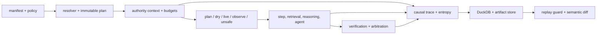
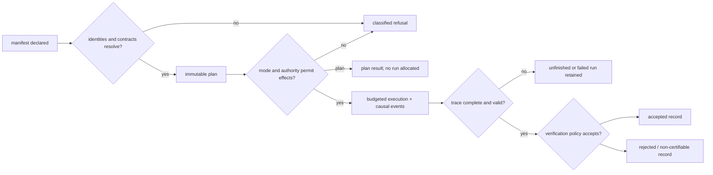

# Architecture

Runtime separates immutable authority contracts, execution strategy, trace
capture, verification arbitration, and durable storage. This prevents execution
order or database state from silently becoming policy.

## Governed execution structure

```mermaid
flowchart LR
    manifest["manifest + policy"]
    planner["resolver + immutable plan"]
    context["authority context + budgets"]
    strategy["plan / dry / live / observe / unsafe"]
    executors["step, retrieval, reasoning, agent"]
    verify["verification + arbitration"]
    recorder["causal trace + entropy"]
    store["DuckDB + artifact store"]
    replay["replay guard + semantic diff"]

    manifest --> planner --> context --> strategy --> executors --> verify
    context --> recorder
    executors --> recorder
    verify --> recorder --> store --> replay
```

Only the runtime authority can append governed events. The execution strategy
does work through bounded executors; the recorder assigns causal order; the
verifier evaluates results and policy; finalization freezes the trace before
the store records it as complete authority.

## Mode semantics

| Mode | Behavior | Evidence boundary |
| --- | --- | --- |
| `plan` | resolve and fingerprint without executing | no run ID or trace |
| `dry-run` | use simulated execution while exercising event and persistence contracts | not evidence that live effects would succeed |
| `live` | execute with full verification coverage | authoritative only after finalization and arbitration |
| `observe` | retain externally observed work under observer policy | cannot reconstruct events the host omitted |
| `unsafe` | execute under explicit reduced guarantees | warning is retained; result is not equivalent to governed live work |

## Module authority

| Area | Authority |
| --- | --- |
| `contracts` and `model/flows` | flow, step, dataset, artifact, and compatibility contracts |
| `application/planner.py` and flow preparation | resolution, plan identity, environment, and execution preparation |
| `runtime/context.py`, `runtime/budget.py`, and `core/authority.py` | authority-bearing context and resource policy |
| `runtime/execution` | lifecycle plus step, retrieval, reasoning, agent, dry, live, and observer execution |
| `verification` and `model/verification` | engine findings, contradiction handling, arbitration, and final decisions |
| `observability/capture` and `classification` | causal events, environment, time, determinism, entropy, and fingerprints |
| `observability/storage` | migration-owned, single-writer DuckDB state and typed reconstruction |
| `application/replay_*` and `observability/analysis` | retained-run loading, replay guards, drift, correlation, and semantic diff |

## Persistence model

The store commits record groups at multiple lifecycle boundaries. An
interruption may therefore leave a valid unfinished run with checkpoints and a
subset of later records. That state is resumable evidence, not a completed
run. Artifact metadata can live in DuckDB while payload bytes remain in the
artifact store; both are required for complete retention.

The stored projection is replay-oriented rather than a generic serialization
of every in-process object. Use migration-aware typed readers, preserve the
schema contract hash, and never infer semantic completeness from readable
tables alone.

## Authority gates

Runtime does not grant one blanket permission to a flow. Authority is checked
at the boundary where each stronger effect becomes possible:

```mermaid
flowchart LR
    declare["manifest declared"] --> resolve{"identities and contracts resolve?"}
    resolve -->|no| refused["classified refusal"]
    resolve -->|yes| plan["immutable plan"]
    plan --> authorize{"mode and authority permit effects?"}
    authorize -->|plan| planned["plan result; no run allocated"]
    authorize -->|no| refused
    authorize -->|yes| execute["budgeted execution + causal events"]
    execute --> finalize{"trace complete and valid?"}
    finalize -->|no| incomplete["unfinished or failed run retained"]
    finalize -->|yes| arbitrate{"verification policy accepts?"}
    arbitrate --> accepted["accepted record"]
    arbitrate --> rejected["rejected / non-certifiable record"]
```

| Gate | Evidence examined | Stronger claim unlocked |
| --- | --- | --- |
| resolution | manifest state, tenant, dataset, dependencies, contracts and environment | the declaration can become a stable plan |
| execution authority | mode, authority token, policy, executor bindings and budgets | declared effects may begin |
| trace finalization | causal order, required events, artifacts, evidence, claims and entropy | the execution record is closed for arbitration |
| verification arbitration | engine findings, blocking policy and certifiability | the finalized run may be accepted under this policy |
| persistence | finalized projection plus resolvable artifact payload custody | the accepted or rejected record can be inspected later |
| replay | original envelope, retained inputs, current identities and semantic diff | the later observation may receive a replay verdict |

Failure at a later gate does not erase evidence from an earlier one. A rejected
run can have a valid plan and finalized trace; an interrupted run can retain
valid checkpoints; and a readable stored record can remain non-certifiable.
This monotonic evidence model is what makes recovery and refusal auditable.

## Navigate the design

| Need | Guide |
| --- | --- |
| Locate authority in code | [Module map](module-map.md) and [Code navigation](code-navigation.md) |
| Follow preparation, execution, finalization, and replay | [Execution model](execution-model.md) |
| Understand allowed dependencies | [Dependency direction](dependency-direction.md) |
| Distinguish checkpoints, traces, DuckDB, and artifact payloads | [State and persistence](state-and-persistence.md) |
| Integrate a lower-layer executor or storage boundary | [Integration seams](integration-seams.md) and [Extensibility model](extensibility-model.md) |
| Trace authority, verification, and storage failures | [Error model](error-model.md) |
| Review structural risks | [Architecture risks](architecture-risks.md) |
