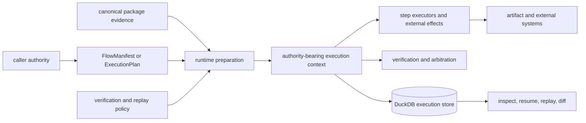
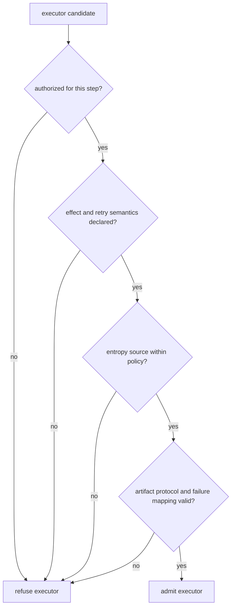

# Integration Seams

Runtime composes contracts with different owners and different failure modes.
Its integration job is to preserve authority: who supplied the dataset, who
defined the plan, which executor could create effects, which verifier produced
findings, which policy arbitrated them, and which store retained the result.

## Authority Map

Runtime may accept or refuse the composed run. It does not take ownership of
ingest normalization, index geometry, reason support semantics, or agent role
lifecycle.

## Seam Contracts

| Seam | Required input | Runtime records or decides | Refusal boundary |
| --- | --- | --- | --- |
| manifest and plan | tenant, dataset, dependency graph, package identities, determinism and replay posture | ordered fingerprinted execution plan | changed or incomplete authority identity |
| lower package | governed artifact plus producer identity and status | linkage into the whole-run evidence graph | opaque payload, missing provenance, incompatible status |
| executor | declared effect class, credentials, entropy, idempotency and failure mapping | intent, invocation, causal events, result, checkpoint | unauthorized effect or unsafe retry semantics |
| artifact store | payload identity, digest, parentage, resolver | metadata and evidence references | unresolved, corrupt, or untrusted payload |
| verification | registered rules over claims, evidence, artifacts and entropy | complete findings and rule coverage | missing mandatory rule or invalid evidence |
| arbitration | fingerprinted policy and verification statuses | accept, reject, or non-certifiable decision | policy mismatch or prohibited finding |
| execution store | read or write capability with tenant scope | causal history, checkpoint, final trace and replay inputs | wrong authority, schema, tenant, or finalized state |
| client surface | validated Python/CLI request or implemented HTTP operation | result or structured refusal | schema-only HTTP run/replay operation |

## Canonical Package Custody

| Producer | Runtime consumes | Producer retains authority over |
| --- | --- | --- |
| ingest | dataset identity, normalized source state, provenance | acquisition, normalization, chunk coordinates |
| index | execution artifact, backend identity, ranked evidence, completion class | vector geometry, capability and retrieval semantics |
| reason | claims, exact supports, verification report, reason bundle | claim construction and evidence linkage |
| agent | task identity, ordered trace, decisions, convergence and termination | role orchestration and provider adaptation |

Pass stable identifiers, hashes, classifications, and complete artifacts. Display
names and logs are not cross-package identity.

The installed research executor constructs a Runtime-side implementation of
Agent's typed research port. It adapts persistent Index retrieval and Reason
counterevidence/convergence services, then delegates call selection and causal
trace production to Agent's application service. Runtime retains and publishes
the returned artifact graph; it does not hard-code a
plan/skeptic/analyze/terminate script.

## Executor Admission

External tools execute beyond DuckDB's transaction. Runtime can record intent,
invocation, result, entropy, and checkpoint, but it cannot roll back a provider
call, filesystem write, or service mutation. A mutating executor therefore
requires an idempotency key, deduplication, or compensation that survives
resume.

DuckDB records artifact identity, hashes, parentage, and evidence references.
Payload availability remains the artifact store's responsibility and must be
verified before an artifact supports acceptance or replay.

## Verification, Persistence, And Replay

Verification creates rule findings; arbitration applies policy to those
findings. An arbitration pass is not factual truth. Retain rule identity,
coverage, findings, policy fingerprint, decision, and certifiability together.

Write capability is required for execution and resume. Read capability is
sufficient for inspection and comparison. The DuckDB implementation is
single-writer and local. Replay compares a new execution with retained plan,
dataset, envelope, trace, policy, environment, and artifact identity under the
original exact or bounded rule.

## Client Surfaces

The CLI invokes the canonical application and renders machine-readable
failures. `bijux-canon` and `agentic-flows` are compatibility commands to the
same runtime authority.

The installed HTTP v2 application composes the same canonical application
service as the CLI, including durable workflow and replay jobs, bounded reads,
and typed failures. The separate v1 compatibility application implements
probes but returns `501 Not Implemented` for run and replay. OpenAPI presence
without live installed workflow evidence must not be interpreted as execution
capability.

See [API surface](../interfaces/api-surface.md) for endpoint posture and
[artifact contracts](../interfaces/artifact-contracts.md) for runtime custody.
