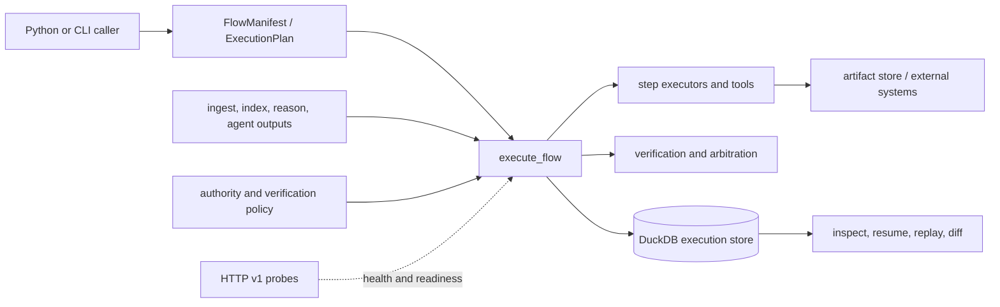

# Integration Seams

Runtime integrates contracts that have different authority and failure modes.
Each seam is explicit so a deployment can tell which component supplied an
identity, performed a side effect, retained evidence, or decided acceptance.

## Manifest and plan seam

The stable Python entry point accepts a `FlowManifest` or resolved
`ExecutionPlan`, plus an explicit `RunMode` and execution resources. A manifest
declares tenant, dataset, agents, dependencies, retrieval contracts,
verification gates, determinism, entropy, and replay posture. Planning resolves
that declaration into ordered, fingerprinted execution; it does not execute a
tool or create a stored run.

Callers that retain a plan must treat its manifest, dataset, environment, and
policy fingerprints as one contract. Replacing any part while reusing the old
plan identity defeats replay comparison and is rejected at the application
boundary.

## Canonical package seam

Runtime consumes governed outputs from the lower canonical packages:

| Producer | Runtime consumes | Authority that remains with the producer |
| --- | --- | --- |
| ingest | dataset identity, normalized source state, provenance | source acquisition and normalization |
| index | retrieval contracts and indexed dataset identity | backend, metric, and retrieval semantics |
| reason | evidence-addressed reasoning and claims | claim construction and evidence linkage |
| agent | role outputs, decisions, and provider events | role lifecycle and provider adaptation |

An integration should pass stable identifiers and hashes, not infer identity
from display names or reconstruct provenance from logs.

## Executor and side-effect seam

Step executors receive a resolved step and authority-bearing context. Tool and
agent calls occur beyond the execution database's transaction boundary. The
runtime records intent, causal events, results, entropy, and checkpoints, but a
committed DuckDB row cannot roll back an external API call or filesystem write.
Live integrations therefore need idempotency keys or their own compensation
strategy.

The runtime artifact interface may point to a separate payload store. DuckDB
retains artifact identity, hashes, parentage, and evidence relationships; it is
not proof that every external payload remains available.

## Verification seam

Verification engines consume recorded claims, evidence, artifacts, entropy,
and configured rules. Arbitration then turns their statuses into a governed
decision under a fingerprinted policy. These are two distinct seams: a rule
result is evidence for arbitration, and an arbitration decision is not a claim
that the underlying scientific statement is true.

## Persistence and replay seam

The execution store exposes separate read and write capabilities. Execution
and resume require write authority; inspection, explanation, and comparison
can use read authority. The DuckDB implementation is single-writer and guarded
by a sibling lock file. It is appropriate for a local governed execution
record, not shared concurrent mutation across workers.

Replay loads the retained plan, dataset descriptor, envelope, trace, and policy
evidence, then compares a new execution under the original acceptability rule.
Exact and bounded replay are explicit policies. A persisted second run is not,
by itself, evidence of equivalence.

## Command, HTTP, and compatibility seams

The canonical CLI loads manifests and policy, invokes the same application
surface, and renders machine-readable failures. The `bijux-canon` and
`agentic-flows` commands are compatibility entry points to that implementation.

The v1 HTTP application currently provides health and readiness probes. Run
and replay request schemas are tracked, but their endpoints return `501 Not
Implemented`; clients must not interpret schema presence as executable remote
runtime support. See [API Surface](../interfaces/api-surface.md) and
[Compatibility Commitments](../interfaces/compatibility-commitments.md).
