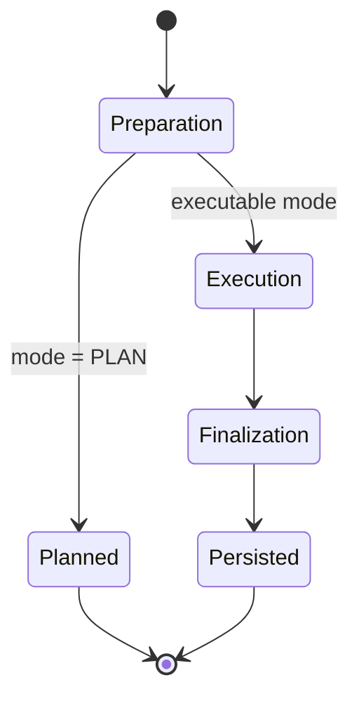
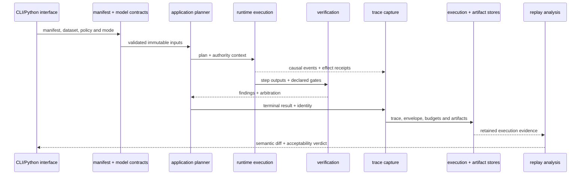

# Module Map

`bijux-canon-runtime` is the execution authority for canon flows. It resolves a
structural manifest into a plan, enforces mode and determinism policy, records
causal execution evidence, arbitrates verification, persists the run, and
decides whether replay differences are acceptable.

## Ownership by module

| Module | Owns | Use it when |
| --- | --- | --- |
| `model.flows` | Immutable manifest structure and declared flow contract | Defining tenant, dataset, agents, gates, determinism, and replay posture |
| `model.execution` | Execution plans, traces, run modes, replay envelopes, and non-determinism intent | Describing resolved or recorded execution |
| `model.datasets` | Dataset identity, state, version, hash, and storage location | Binding execution to a governed dataset |
| `model.artifact` | Artifact identity, evidence, and entropy budgets | Describing what a run consumes or emits |
| `model.policy` | Runtime policy declarations | Governing authority and acceptance behavior |
| `model.verification` | Gates, results, policies, and arbitration records | Determining how findings affect continuation |
| `application` | Planning, preparation, execution, finalization, persistence, and replay coordination | Invoking a complete runtime use case |
| `runtime.execution` | Step execution, ordering, partial failure, and resume mechanics | Implementing the execution strategy |
| `runtime` | Context, budget, artifact store, and runtime services | Supplying resources to a governed run |
| `verification` | Verification rule execution and arbitration | Enforcing declared gates at runtime phases |
| `observability.capture` | Stable events, causal ordering, trace recording, and observed runs | Recording execution evidence |
| `observability.storage` | DuckDB run, event, artifact, envelope, budget, intervention, and replay state | Persisting and loading governed runs |
| `observability.analysis` | Semantic trace diff and replay analysis | Comparing persisted execution histories |
| `interfaces.cli` | Manifest and policy loading, run modes, replay, inspection, diff, and store validation | Operating runtime from a shell |
| `api.v1` | Experimental HTTP health, readiness, and contract stubs | Integrating only after reviewing current implementation limits |

## Preparation, execution, finalization

Preparation requires exactly one of a `FlowManifest` or resolved
`ExecutionPlan`. Determinism must be explicit. Plan mode resolves and validates
without a trace or run identifier. Executable modes require the resources and
policy appropriate to their authority; finalization checks runtime semantics
before persisted state is presented as complete.

## Walk one governed run through the architecture

Planning fixes the work and its identity before execution. Executors perform
only the effects admitted by the plan and authority context. Verification
produces findings before policy arbitrates them. Persistence retains both the
terminal projection and the evidence needed to challenge or replay it.

## Dependency direction

| Layer | May depend on | Must not acquire |
| --- | --- | --- |
| `contracts` / `model` | immutable runtime vocabulary and validation | DuckDB, interfaces or executor implementations |
| `application` | models, planning policy, execution protocols, verification and persistence protocols | duplicate domain contracts or interface-specific behavior |
| `runtime.execution` | plan/context contracts, bounded integrations, event and effect protocols | CLI/API concerns or permission to widen authority |
| `verification` | immutable outputs, evidence and declared gate policy | mutation of the evidence being judged |
| `observability` | stable events, identities, artifacts and replay envelopes | permission to rewrite execution policy while recording it |
| `interfaces` | application entry points, loaders and result translation | a second planner, executor or verification policy |
| `api.v1` | legacy HTTP contracts and readiness dependencies | mounting compatibility-only run/replay as the supported product server |
| `interfaces.http` | installed Runtime v2 server and transport translation | duplicating application behavior or weakening request bounds |

The v2 composition calls typed domain application services and preserves their
identities in Runtime-owned records. A successfully imported package is not
sufficient proof of live composition; installed acceptance must execute the
requested operation and validate its causal artifacts and failure mapping.

## Authority and replay

The manifest declares flow and tenant identity, dataset fingerprint,
determinism level, replay acceptability, entropy budget, replay envelope,
agents, dependencies, retrieval contracts, verification gates, allowed
variance, and non-determinism intent. Authority tokens and verification policy
constrain what execution may do; neither is inferred from ambient process
state.

Replay compares stored and current policy, dataset, environment, plan, entropy,
artifact, and trace identity. A semantic diff is judged against the original
replay acceptability; persisting a second output does not make the two runs
equivalent.

## Package boundaries

Ingest prepares source material, index governs vector execution, reason owns
claim evidence, and agent owns role lifecycle. Runtime composes and governs
their execution but does not redefine their domain contracts. Repository
maintenance and release automation remain outside the runtime package.

## Source and proof

- [`model`](https://github.com/bijux/bijux-canon/tree/main/packages/bijux-canon-runtime/src/bijux_canon_runtime/model) defines durable manifests, plans, policies, and artifacts.
- [`application`](https://github.com/bijux/bijux-canon/tree/main/packages/bijux-canon-runtime/src/bijux_canon_runtime/application) owns planning through persisted finalization.
- [`observability`](https://github.com/bijux/bijux-canon/tree/main/packages/bijux-canon-runtime/src/bijux_canon_runtime/observability) captures, stores, and compares execution evidence.
- [`tests`](https://github.com/bijux/bijux-canon/tree/main/packages/bijux-canon-runtime/tests) covers authority, determinism, persistence, recovery, replay, and hostile-state behavior.
