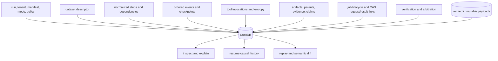
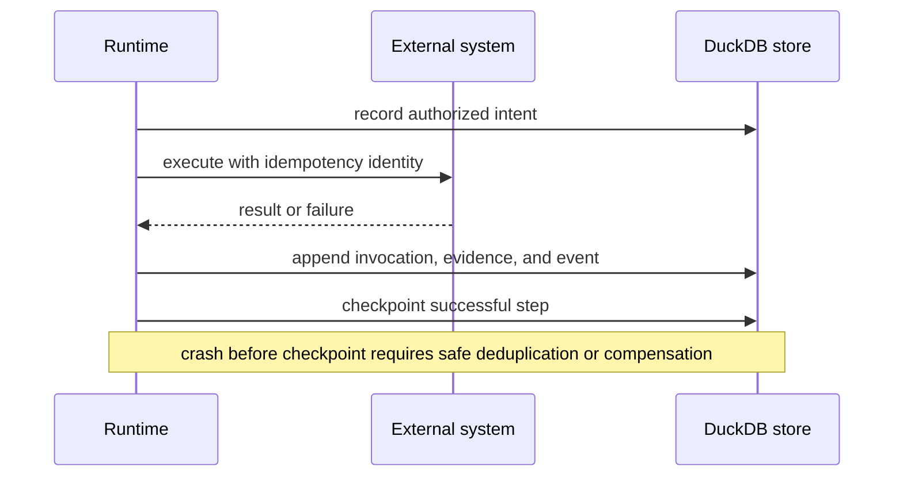

# State and Persistence

Runtime persists execution authority and causal evidence in DuckDB. The store
supports audit, resume, and replay; it does not own transient executor objects,
external payload durability, or effects committed in other systems.

## Stored Evidence Graph



The governed schema includes runs, datasets, normalized steps, events,
checkpoints, artifact parentage, evidence, claim identifiers, tool invocations,
entropy budgets and use, nondeterminism intent, replay envelopes, verification,
arbitration, migrations, and the schema-contract hash.

The installed local execution path writes immutable bytes to the filesystem CAS,
reloads and verifies them, and only then registers their descriptor and dependency
edges in DuckDB. A database failure can therefore leave an unreachable CAS object,
which retention can collect, but it cannot publish metadata pointing at absent
bytes. Startup reconciles dependency-complete CAS objects from compatible prior
workspaces and refuses a DuckDB payload identity whose bytes are absent. Durable
job requests and results use the same protocol and the result object depends on
its exact request object.

## Lifecycle And Commit Signals

| State | Durable evidence | Allowed operation | Prohibited interpretation |
| --- | --- | --- | --- |
| planned | resolved plan returned in memory; no run row in plan mode | review or export plan | tool execution or persisted-run claim |
| in progress | run, dataset, plan, causal events and optional checkpoint | inspect, diagnose, or resume after authority validation | completed or replay-equivalent claim |
| finalized | immutable final trace and linked execution evidence | inspect, compare, and replay under retained policy | mutation or continuation of the same history |
| non-certifiable | execution evidence with explicit certification restriction | inspect and diagnose bounded outcome | certified acceptance or strict replay claim |

Preparation registers the dataset, begins the run, and stores normalized steps.
Execution appends causally ordered evidence. Finalization binds the trace,
verification policy, resolver identity, contradiction and arbitration state,
entropy exhaustion, and certifiability.

## Single-Writer And External Transactions

The store takes a sibling lock file and assumes one writer. A writer must close
the store to release its connection and lock. Another process must not delete a
live lock to force access.

Store methods commit their own related records. CAS publication uses a bounded
prepare-then-register protocol because DuckDB cannot atomically commit a
filesystem rename. DuckDB also cannot transact with an external API, vector
service, or model provider. An effect can succeed before the event or checkpoint
becomes durable.



Resume is safe only when the executor's effect contract makes repeating or
reconciling the gap safe.

## Resume Authority

Resume loads the latest durable events, artifacts, evidence, tool invocations,
entropy use, claim IDs, and checkpoint indexes. Before appending history, it
must revalidate tenant, manifest, plan, dataset, mode, policy, store, executor,
and artifact identities. Any meaning-bearing mismatch creates a new run rather
than continuing the old one.

Finalized traces are immutable. Corrections and changed authority require a
linked successor run.

## Schema, Backup, And Restore

Ordered migrations and the canonical schema-contract hash govern database
shape. Direct table edits, untracked migrations, or partial-table copies can
leave a syntactically readable database that is semantically invalid for resume
or replay.

Back up only when the writer is quiescent or through a DuckDB-compatible
snapshot mechanism. Preserve manifests, policies, external payloads, and
resolver data required by stored references. Validate a restored database with:

```bash
bijux-canon-runtime validate db \
  --db-path artifacts/bijux-canon-runtime/runs.duckdb \
  --json
```

Then inspect representative finalized and incomplete runs, resolve artifact
payloads, and perform a policy-appropriate replay. File readability alone does
not prove recoverability.

## Retention And Access

- Configure an explicit database and artifact root for every deployment.
- Enforce tenant access with host and storage identities, not only record fields.
- Retain incomplete and failed runs as evidence; never edit terminal status to
  simplify reporting.
- Encrypt and control traces, evidence, prompts, provider metadata, and payloads
  according to their data classification.
- Test checkpoint recovery, artifact restoration, and replay at the required
  retention horizon.

See [artifact contracts](../interfaces/artifact-contracts.md) for the persisted
model and [failure recovery](../operations/failure-recovery.md) for resume and
repair decisions.
