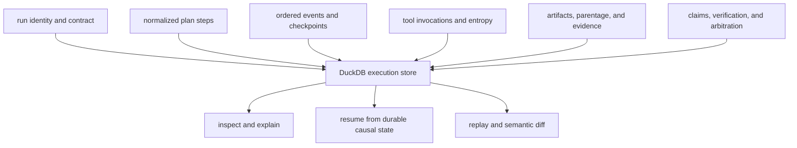

# State and Persistence

Runtime persists execution authority in DuckDB. The store is an audit, resume,
and replay boundary: it records causal state produced by execution, while
transient executor objects and caches remain in memory.

## Stored Evidence



The governed schema includes runs, datasets, normalized steps, events,
checkpoints, artifacts and parent edges, evidence, claim identifiers, tool
invocations, entropy budgets and use, non-determinism intent, replay envelopes,
verification state, schema migrations, and the active schema-contract hash.

## Run Lifecycle

`begin_run` registers the dataset, allocates a run identifier, writes the plan
contract and mode, and initializes the run as not finalized. Execution appends
causally ordered records. `finalize_run` binds the finalized trace, verification
policy fingerprint, resolver identity, contradiction and arbitration state,
entropy exhaustion, and certifiability.

These lifecycle states remain distinct:

- **planned**: no persisted run exists in plan mode;
- **in progress**: a run exists but is not finalized and may be resumable;
- **finalized**: the trace boundary is closed and supports inspection or replay;
- **non-certifiable**: execution evidence exists, but the run cannot make the
  stronger replay or acceptance claim.

## Single-Writer Boundary

The DuckDB store acquires a sibling lock file and assumes one writer. It does
not promise concurrent mutation semantics. A long-lived process must close the
store to release its connection and lock; a second writer should not remove a
lock merely to force access.

The store commits groups of related records as its methods complete, but it is
not the transaction manager for external tools or application side effects. A
persisted event cannot roll back a provider call, filesystem write, or service
mutation that occurred outside DuckDB.

## Read and Write Capabilities

Write and read stores are separate interfaces. Live and resumed execution use
write capability; inspection and replay use read capability. This separation
allows review paths to run without accidental mutation authority.

Resume loads the last durable events, artifacts, evidence, tool invocations,
entropy use, claims, and checkpoint indexes. It must revalidate tenant,
manifest, plan, dataset, policy, and store identity before adding new causal
history. Changed authority requires a new run, not continuation of the old one.

## Schema Governance

The package ships ordered migrations, a canonical schema contract, and its
hash. Opening a store applies or validates that governed schema. Direct table
edits, untracked migrations, or copying only selected tables may leave a
database syntactically readable but semantically unsuitable for replay.

Back up the DuckDB file only when the writer is quiescent or through a
DuckDB-compatible snapshot procedure. Preserve the schema metadata with the
data, and verify a restored copy with:

```bash
bijux-canon-runtime validate db \
  --db-path artifacts/bijux-canon-runtime/runs.duckdb \
  --json
```

## Retention and Access

- Set an explicit database path for every deployment.
- Restrict access by tenant and operating-system identity; traces and evidence
  may contain sensitive derived content.
- Retain source manifests, policies, and external artifact payloads alongside
  the database when replay depends on them.
- Preserve incomplete and failed runs for investigation instead of editing
  their terminal state.
- Test restoration and replay, not only file-level backup success.

See [artifact contracts](../interfaces/artifact-contracts.md) for the persisted
model and [failure recovery](../operations/failure-recovery.md) for resume and
repair decisions.
