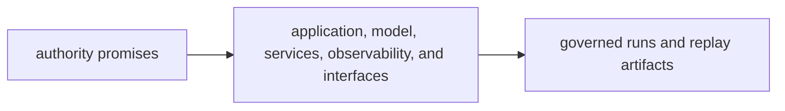

# Capability Map

The capability map for `bijux-canon-runtime` should let a reviewer tie authority claims to the code that accepts, persists, replays, and governs runs. If authority cannot be mapped clearly, the package is relying on convention instead of policy.

## Capability Flow

This page should make runtime capability feel policy-bearing and concrete. A
reviewer should be able to point from authority promise to module area to
durable runtime output without relying on convention.

## Capability To Code

- `application/` owns execution authority entrypoints and governed run flow
- `model/` and runtime services own acceptance, verification, and persistence rules
- `observability/` and interfaces own the durable artifacts and surfaces that make replay possible

## Visible Outputs

- governed run records
- persistent traces and replay artifacts
- runtime-facing contracts that define what a durable run means

## Design Pressure

Runtime authority becomes hand-wavy when acceptance, persistence, and replay
claims cannot be tied to named modules and artifacts. The package has to keep
policy and output visibly linked.
