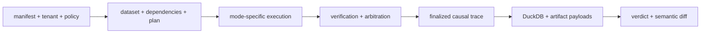

# Capability Map

`bijux-canon-runtime` turns lower-layer outputs into governed runs by applying
manifest authority, execution policy, verification arbitration, causal
recording, persistence, and replay acceptance. Its capabilities concern who
may do what under which retained evidence.

```mermaid
flowchart LR
    manifest["manifest + tenant + policy"]
    resolve["dataset + dependencies + plan"]
    execute["mode-specific execution"]
    verify["verification + arbitration"]
    freeze["finalized causal trace"]
    persist["DuckDB + artifact payloads"]
    replay["verdict + semantic diff"]

    manifest --> resolve --> execute --> verify --> freeze --> persist --> replay
```

## Authority and execution capabilities

| Capability | Owning area | Produced evidence |
| --- | --- | --- |
| Manifest authority | `contracts/`, `model/flows/` | flow, tenant, agents, dependencies, gates, determinism, replay policy |
| Dataset admission | dataset contracts and planning | exact descriptor, deprecation decision, dataset identity |
| Dependency resolution | application planner | normalized ordered steps and immutable plan hash |
| Environment capture | observability capture and classification | environment, package, resolver, and policy fingerprints |
| Mode selection | preparation and execution policy | plan, dry-run, live, observe, or unsafe semantics |
| Authority-bearing context | `runtime/context.py`, `core/authority.py` | permitted effects, tenant, budgets, store identity |
| Lower-layer execution | step, retrieval, reasoning, and agent executors | correlated outputs, errors, evidence, claims, tool calls |
| Budget enforcement | runtime budget and entropy models | resource and entropy use, exhaustion, refusal or warning |

## Verification, persistence, and replay capabilities

| Capability | Owning area | Produced evidence |
| --- | --- | --- |
| Causal recording | trace recorder and event causality | ordered events, hashes, causal tags, checkpoints |
| Verification | verifier orchestration and rules | per-engine findings, violated rules, targets, costs |
| Arbitration | verification arbitration | policy fingerprint, participating engines, final decision |
| Trace finalization | execution lifecycle finalizer | immutable trace, certifiability, termination state |
| Incremental persistence | migration-owned DuckDB store | runs, steps, events, tools, artifacts, evidence, claims, entropy |
| Resume | lifecycle preparation and state tracker | restored indices and state after the last completed checkpoint |
| Artifact lineage | artifact contracts and store | immutable identity, hash, producer, parentage, tenant, scope |
| Replay analysis | replay support and observability analysis | envelope comparison, semantic diff, acceptability verdict |
| Drift analysis | correlation, invariants, comparative analysis | earliest structural, temporal, dataset, policy, or content divergence |

## Mode capability boundary

Plan mode resolves authority without allocating a run. Dry run exercises the
recording and persistence path with simulated effects. Live mode requires
verification coverage. Observe mode governs evidence supplied by an external
execution. Unsafe mode records reduced guarantees and remains distinguishable
from live authority.

## Interface availability

Python and CLI provide governed execution and read-side inspection. HTTP
provides implemented liveness and storage readiness; versioned flow run and
replay requests validate contracts but currently return `501 Not Implemented`.
Schema presence is compatibility evidence, not remote execution capability.

Runtime cannot undo external effects, reconstruct omitted host events, or make
a passing verification rule set equivalent to factual truth. See
[Invariants](../quality/invariants.md) for authority laws and
[Known limitations](../quality/known-limitations.md) for execution,
determinism, verification, persistence, and deployment boundaries.
