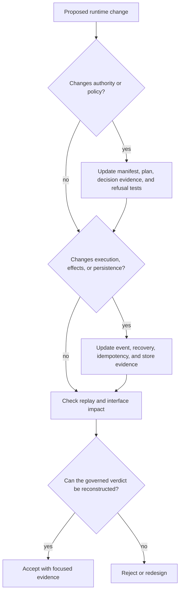

# Change Principles

Changes to `bijux-canon-runtime` must make authority more explicit. A new
executor, store, policy, or interface is safe only when the runtime can still
explain what was declared, what was admitted, which effects were permitted,
which checks ran, why the final verdict followed, and what a later replay may
compare.

## Preserve the authority chain

Manifest validation, resolution, planning, authority checks, execution,
verification, arbitration, finalization, and persistence are distinct
decisions. Do not bypass one by importing the outcome of another. Every
authority-changing path needs an explicit refusal result and retained evidence
for both positive and negative decisions.

Lower-package artifacts retain their original meaning. Runtime may require,
compare, or reject ingest, index, reason, and agent evidence; it must not
reimplement their normalization, ranking, support, or lifecycle semantics.

## Preserve mode semantics

`plan`, `dry-run`, `live`, `observe`, and `unsafe` are governed modes rather
than convenience flags. A change must state which steps, effects, persistence,
checks, and verdicts are permitted in each affected mode. Never allow an
observer or dry run to acquire live effects through a shared helper.

Unsafe execution must remain visibly unsafe in the plan, event record, stored
configuration, diagnostics, and result interpretation. It must not be promoted
to certifiable merely because execution completed.

## Preserve effect and recovery honesty

The DuckDB execution store provides durable local state under a single-writer
lock. It does not create a distributed transaction with external systems.
Changes involving effects must define idempotency, receipt capture, retry
behavior, crash windows, and the classification of an effect whose outcome is
unknown.

Recovery must proceed from retained checkpoints and events. It must not infer
that an absent local completion event means a remote effect did not occur.

## Preserve replay meaning

Dataset identity, policy fingerprint, determinism level, entropy consumption,
replay envelope, and acceptability threshold are part of the historical run.
Do not evaluate replay under silently changed policy. A compatibility rule may
admit declared evolution, but the rule and resulting diff must be retained.

Replay comparisons must distinguish exact equality, admitted variance, drift,
and non-certifiability. A successful comparison covers only the captured
contract; it is not evidence that an external provider or environment was
globally unchanged.

## Preserve persistence invariants

Store changes require explicit migration and compatibility behavior. Readers
must not observe a partially finalized trace as accepted state. Writers must
respect the single-writer contract, and migrations must preserve tenant, run,
policy, dataset, event-order, and replay identities.

Do not broaden storage into runtime authority. A record existing in DuckDB does
not make it admissible; the retained decision and its evidence do.

## Keep ownership in the right package

| Change concerns | Owning surface |
| --- | --- |
| parsing, normalization, chunks, or embeddings | `bijux-canon-ingest` |
| retrieval contracts, ranking, or backend capability | `bijux-canon-index` |
| claims, support, reasoning traces, or reasoning verification | `bijux-canon-reason` |
| roles, providers, lifecycle, or convergence | `bijux-canon-agent` |
| manifest admission, cross-package policy, effects, arbitration, persistence, or workflow replay | `bijux-canon-runtime` |

Composition is runtime's responsibility; semantic duplication is not.

## Evidence expected with a change

| Changed surface | Minimum focused evidence |
| --- | --- |
| manifest or resolution | structural rejection, semantic refusal, and deterministic plan tests |
| authority or verification policy | accepted, rejected, and non-certifiable fixtures |
| run mode | per-mode effect, event, persistence, and unsafe-warning tests |
| executor or external effect | idempotency, partial failure, retry, and unknown-outcome tests |
| DuckDB schema or store | migration, single-writer, crash recovery, and read-after-finalize tests |
| replay contract | exact, bounded, policy-mismatch, dataset-mismatch, and drift tests |
| CLI | exit, structured output, persisted state, and diagnostic tests |
| HTTP schema or handler | schema-hash, contract, implemented-status, and failure-envelope tests |

Update public examples and artifact descriptions whenever an operator would
observe different policy, mode, event, verdict, replay diff, or recovery state.

## Refuse the change when

- a well-formed input can reach effects before semantic admission;
- a lower-layer success is treated as whole-run acceptance;
- dry-run or observer execution can cause live effects;
- unsafe execution can appear certifiable without explicit qualification;
- a crash window or unknown external effect is hidden;
- replay uses changed policy or data identity without reporting the mismatch;
- a stored trace can be mutated after finalization;
- HTTP documentation claims execution that still returns `501`; or
- runtime becomes a holding area for unrelated late-stage logic.

A sound change expands runtime capability while making the authority decision
and its retained evidence easier to reconstruct.
