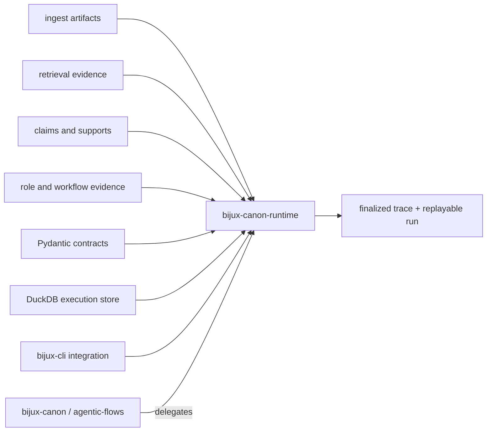

# Dependencies and Adjacencies

`bijux-canon-runtime` is the final authority boundary for a governed flow. It
depends directly on the four lower canonical packages, but consumes their
typed outputs without absorbing their domain semantics. DuckDB, Pydantic, and
CLI infrastructure support authority; the manifest, policy, trace, and replay
contracts define it.

## Dependency shape

The arrows from lower packages carry evidence and execution capabilities. They
do not transfer ownership of normalization, ranking, claim construction, or
role behavior to runtime.

## Dependency roles

| Dependency | Runtime use | Authority limit |
| --- | --- | --- |
| `bijux-canon-ingest` | dataset preparation identity and provenance | Ingest owns source normalization and chunk semantics |
| `bijux-canon-index` | retrieval contracts, indexed-dataset identity, and results | Index owns backend, metric, budget, witness, and retrieval replay semantics |
| `bijux-canon-reason` | evidence-addressed claims and reasoning bundles | Reason owns claim construction, support linkage, and reasoning verification |
| `bijux-canon-agent` | role outputs, decisions, provider events, and workflow evidence | Agent owns role lifecycle and orchestration semantics |
| DuckDB | Migration-governed execution record | Database durability does not roll back external effects or store every artifact payload |
| Pydantic | Strict manifests, plans, policies, events, artifacts, and results | Validation does not authenticate the manifest author or dataset source |
| `bijux-cli` | Canonical command integration | Compatibility commands delegate to the same runtime authority |

## Authority across adjacencies

Runtime owns decisions that span lower packages:

- whether a manifest, mode, dataset, and policy form an executable contract;
- whether declared dependencies form a valid plan;
- what budgets and entropy are permitted across the flow;
- which lower-layer executor is invoked for a resolved step;
- how events, tools, artifacts, evidence, claims, and checkpoints enter the
  authoritative trace;
- how verification results are arbitrated under the fingerprinted policy;
- whether the trace can be finalized, resumed, replayed, or accepted.

Runtime does not infer missing lower-layer evidence from logs, display names,
or a final prose response. A producer's stable identifiers and hashes must
cross the boundary intact.

## Persistence adjacencies

The DuckDB execution store and artifact payload store are separate resources.
The database retains artifact identity, content hashes, parentage, and evidence
relationships; payload bytes can live elsewhere. Native indexes, datasets,
provider records, and external systems have their own custody and consistency
models.

A governed retention set therefore includes the database, active migration and
schema contract, referenced payloads, manifest and policy inputs, dataset
identity, and any lower-package artifacts needed for replay.

## Compatibility adjacencies

`bijux-canon` and `agentic-flows` expose compatibility entry points to the
canonical runtime. They do not define alternate execution modes, trace
authority, or replay verdicts. New authority semantics begin here and are
deliberately projected outward.

See [integration seams](../architecture/integration-seams.md) for each
cross-package handoff and [artifact contracts](../interfaces/artifact-contracts.md)
for the durable record that joins them.
