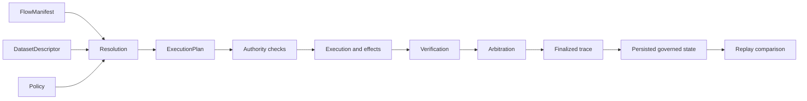

# Domain Language

`bijux-canon-runtime` decides whether a complete Canon run is admissible under
declared policy. Its vocabulary distinguishes structural validity, permission
to act, terminal execution, acceptance, persistence, and replay. Those states
must remain separate because each carries different evidence and authority.

The chain is cumulative. A structurally valid manifest has not yet been
resolved; a resolved plan has not yet been authorized; terminal execution has
not necessarily been accepted; and persisted state is replayable only under
its retained identity and variance policy.

## Declaration and resolution

| Term | Exact meaning |
| --- | --- |
| `FlowManifest` | The declared flow, tenant, steps, dependencies, agents, dataset, verification gates, determinism, entropy, and replay policy. |
| structural validity | Successful construction and field validation of a manifest or model. It does not establish semantic admission. |
| resolution | Binding declared dependencies, dataset identity, policy, and package capabilities into an executable flow. |
| resolved flow | The admitted inputs and `ExecutionPlan` produced by resolution. |
| dataset identity | The descriptor and fingerprint that bind the run to exact governed data. A label or URI alone is not identity. |
| `ExecutionPlan` | The ordered, policy-bearing execution contract created before effects occur. |
| policy fingerprint | The stable identity of the authority or verification policy applied to the run. |

Resolution is allowed to refuse a well-formed manifest. Missing capability,
incompatible data identity, invalid dependency order, or absent policy evidence
are semantic failures rather than parsing errors.

## Authority and execution modes

| Term | Exact meaning |
| --- | --- |
| run authority | Permission to admit inputs, execute steps, allow effects, arbitrate checks, finalize the trace, and persist the resulting state. |
| `plan` | Resolve and emit the execution plan without executing governed work. |
| `dry-run` | Exercise the non-live path and produce its governed evidence without authorizing live effects. |
| `live` | Execute through the normal authority and verification path. |
| `observe` | Inspect or evaluate under observer semantics without claiming live execution authority. |
| `unsafe` | Execute through the explicitly unsafe path, recording the weakened configuration and warning evidence. |
| external effect | A change outside the runtime store, such as a provider call or write to another system. |

An unsafe run is not an ordinary live run with fewer messages. Its weakened
authority must remain visible in configuration, events, result classification,
and any downstream claim of certifiability.

## Verification and acceptance

| Term | Exact meaning |
| --- | --- |
| verification result | The output of a registered check over retained run evidence. |
| arbitration | The runtime decision that interprets verification results under policy. |
| acceptance | The positive authority decision that the complete run satisfies its declared policy. |
| rejection | A governed terminal decision that the run does not satisfy policy. |
| non-certifiable | A terminal classification stating that retained evidence cannot support the requested assurance. |
| completion | The execution strategy reached a terminal point. |
| finalization | The trace was closed against further mutation after runtime semantics completed. |

Completion, finalization, and acceptance are independent. A rejected or
non-certifiable run can have a complete, finalized, and valuable trace.
Likewise, a lower package's successful result is runtime evidence, not automatic
acceptance of the whole flow.

## Persistence and recovery

| Term | Exact meaning |
| --- | --- |
| execution store | The persistence contract for run identity, plans, events, traces, checkpoints, replay envelopes, and decisions. |
| DuckDB store | The local reference implementation, protected by a filesystem single-writer lock. |
| checkpoint | Persisted progress from which the governed recovery path can continue or classify an interrupted run. |
| finalized trace | An immutable ordered execution record with its policy, data, determinism, and replay metadata. |
| recovery | Resumption or classification using retained state after interruption; it is not proof that external effects were rolled back. |

The execution store and an external system do not share a transaction. A crash
can occur after an external effect but before the corresponding local event is
durably recorded. Idempotency, effect receipts, and explicit uncertainty are
therefore part of honest recovery semantics.

## Determinism and replay

| Term | Exact meaning |
| --- | --- |
| determinism level | The declared strength of repeatability expected from the run. |
| entropy budget | The amount and source of admitted nondeterminism. Consuming it must be recorded. |
| replay mode | The policy for comparing a historical trace with a replay attempt. |
| replay envelope | The retained comparison bounds, including allowed variance and reasoning tolerances. |
| replay acceptability | The declared threshold by which differences count as equivalent or unacceptable. |
| replay diff | Structured evidence of identity, event, output, claim, contradiction, or policy differences. |
| drift | An observed difference not admitted by the retained determinism and replay contract. |

Replay is a policy evaluation over retained historical state and a new governed
attempt. Equality may be exact or bounded, depending on the original contract.
A successful replay does not prove that external tools, providers, or the world
were unchanged beyond the evidence captured by the runtime.

## Distinctions that must remain visible

| Do not collapse | Why the distinction matters |
| --- | --- |
| validation and resolution | field shape does not establish semantic admissibility |
| plan and authority | knowing what would execute does not grant permission to execute it |
| completion and acceptance | terminal work can still be rejected or non-certifiable |
| verification and arbitration | check output is evidence; policy decides its consequence |
| finalization and success | immutable trace state does not imply a positive verdict |
| persistence and transactional effects | the local store cannot roll back a remote system |
| replay equality and real-world truth | retained equivalence covers only declared and captured surfaces |
| observer and live execution | observation must not inherit authority merely because it uses the same plan |

## Current HTTP boundary

The versioned HTTP schema defines health, flow execution, and replay envelopes.
Health and readiness are operational surfaces. Flow run and replay handlers
currently return `501 Not Implemented`; the schema documents the intended
contract shape, not an available remote execution service. Use the Python or
CLI surfaces for implemented execution and replay behavior.
