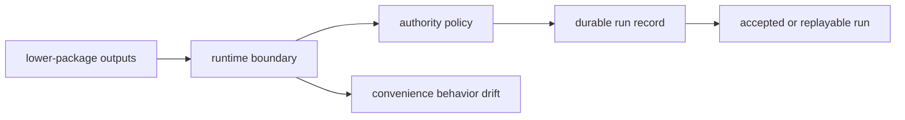

# Foundation

Open this section when the dispute is about authority: what makes a run acceptable, durable, replayable, and governed instead of merely executable. These pages should make `bijux-canon-runtime` defensible as the final authority layer rather than a convenient place for leftovers from lower packages.

## Boundary Model

The runtime foundation pages need to make authority visible before a reader
touches execution detail. Lower-package work arrives here as input, policy is
applied here, and only then does a governed record and verdict exist. That is
the line that keeps runtime from becoming a general-purpose sink.

## Read These First

- open [Ownership Boundary](https://bijux.io/bijux-canon/06-bijux-canon-runtime/foundation/ownership-boundary/) first when the change could be explained as lower-package behavior instead of runtime authority
- open [Package Overview](https://bijux.io/bijux-canon/06-bijux-canon-runtime/foundation/package-overview/) when you need the shortest stable description of the package role
- open [Lifecycle Overview](https://bijux.io/bijux-canon/06-bijux-canon-runtime/foundation/lifecycle-overview/) when the question is how governed execution becomes persisted and replayable

## The Mistake This Section Prevents

The most common mistake here is broadening runtime with convenience behavior that never changes run authority, which makes the package larger without making its role clearer.

## First Proof Check

- `packages/bijux-canon-runtime/src/bijux_canon_runtime/application/execute_flow.py` for execution authority entrypoints
- `packages/bijux-canon-runtime/src/bijux_canon_runtime/observability` for durable replay and trace surfaces
- `packages/bijux-canon-runtime/tests` for acceptance, persistence, and replay proof

## Pages In This Section

- [Package Overview](https://bijux.io/bijux-canon/06-bijux-canon-runtime/foundation/package-overview/)
- [Scope and Non-Goals](https://bijux.io/bijux-canon/06-bijux-canon-runtime/foundation/scope-and-non-goals/)
- [Ownership Boundary](https://bijux.io/bijux-canon/06-bijux-canon-runtime/foundation/ownership-boundary/)
- [Repository Fit](https://bijux.io/bijux-canon/06-bijux-canon-runtime/foundation/repository-fit/)
- [Capability Map](https://bijux.io/bijux-canon/06-bijux-canon-runtime/foundation/capability-map/)
- [Domain Language](https://bijux.io/bijux-canon/06-bijux-canon-runtime/foundation/domain-language/)
- [Lifecycle Overview](https://bijux.io/bijux-canon/06-bijux-canon-runtime/foundation/lifecycle-overview/)
- [Dependencies and Adjacencies](https://bijux.io/bijux-canon/06-bijux-canon-runtime/foundation/dependencies-and-adjacencies/)
- [Change Principles](https://bijux.io/bijux-canon/06-bijux-canon-runtime/foundation/change-principles/)

## Leave This Section When

- leave this section for [Interfaces](https://bijux.io/bijux-canon/06-bijux-canon-runtime/interfaces/) when the question is already about commands, APIs, schemas, or artifacts
- leave this section for [Operations](https://bijux.io/bijux-canon/06-bijux-canon-runtime/operations/) when the problem is running, diagnosing, or recovering runtime behavior
- leave this section for [Quality](https://bijux.io/bijux-canon/06-bijux-canon-runtime/quality/) when the authority story is understood and the open question is whether the package has proved it well enough

## Design Pressure

If a behavior never changes authority, persistence, or replay, it probably does
not belong here. This section has to keep runtime narrow enough that a reviewer
can still explain why the package exists at all.
