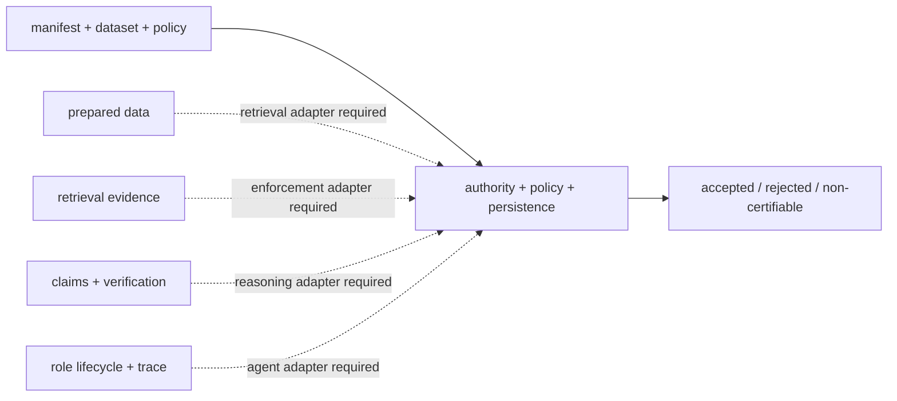

# Foundation

`bijux-canon-runtime` is the final execution authority in the Canon stack. It
resolves a flow manifest, admits a dataset and dependencies, plans execution,
enforces authority and budgets, arbitrates verification, freezes the trace,
persists governed state, and evaluates replay under the original policy.

## Authority boundary

```mermaid
flowchart LR
    manifest["manifest + dataset + policy"]
    ingest["prepared data"]
    index["retrieval evidence"]
    reason["claims + verification"]
    agent["role lifecycle + trace"]
    runtime["authority + policy + persistence"]
    verdict["accepted / rejected / non-certifiable"]

    manifest --> runtime --> verdict
    ingest -. retrieval adapter required .-> runtime
    index -. enforcement adapter required .-> runtime
    reason -. reasoning adapter required .-> runtime
    agent -. agent adapter required .-> runtime
```

Runtime governs lower-layer results; it does not recreate their semantics.
Source normalization remains with ingest, vector execution with index, claim
grounding with reason, and role orchestration with agent. A lower-layer success
becomes runtime evidence, not automatic authorization.

The dashed edges are unresolved live integration seams. They describe the
lower authority whose evidence runtime intends to govern; they do not establish
that installing the five packages creates an executable stack.

## Current composition status

| Runtime step | Callable requested | Canonical package status |
| --- | --- | --- |
| retrieval | `bijux_canon_ingest.retrieve` | absent at the root; implemented ingest retrieval uses a different path-based contract |
| vector enforcement | `bijux_canon_index.enforce_contract` | absent; index owns richer request, capability, artifact and refusal semantics |
| reasoning | `bijux_canon_reason.reason` | absent; native claim, support, trace and verification models require mapping |
| agent execution | `bijux_canon_agent.run` | absent; native execution returns `PipelineResult` with `RunTrace` |

Plan, dry-run, observe, verification, persistence, recovery, and replay logic
remain independently testable runtime capabilities. A live flow that reaches
these loaders requires explicit domain-aware adapters and installed-package
tests proving that identities and typed failures survive each conversion.

## Manifest decisions

| Manifest declaration | Runtime authority |
| --- | --- |
| flow, tenant, agents, steps, dependencies | establishes ownership and valid order |
| dataset descriptor and deprecation policy | admits an exact data identity |
| retrieval contracts and verification gates | requires lower-layer evidence and checks |
| determinism level and nondeterministic intent | separates declared variance from drift |
| entropy budget and allowed variance | bounds uncertainty consumption |
| replay mode, envelope, and acceptability | defines which future comparison can count |

Constructing a `FlowManifest` proves only that its fields have structural
shape. Resolution, planning, authority checks, execution, verification, and
replay enforce the semantic contract.

## Run outcomes

A finalized trace can describe an accepted, rejected, or non-certifiable run.
Finalization means the trace is closed and immutable; it does not mean policy
accepted the work. Verification engine results also remain distinct from the
arbitration decision that interprets them.

| Concept | Meaning |
| --- | --- |
| completion | the execution strategy reached a terminal point |
| finalization | trace mutation ended and runtime semantics passed |
| acceptance | arbitration accepted the run under declared policy |
| certifiability | retained evidence is sufficient to make the governed claim |
| replayability | retained identity and variance policy permit a future comparison |

## Trust limits

Runtime cannot make an external tool trustworthy, undo a remote side effect,
recover state that was never captured, or convert registered verification
rules into scientific truth. DuckDB retains local governed state but is not a
distributed scheduler, a replicated event service, or a transaction manager
for external systems.

## Read by decision

| Decision | Guide |
| --- | --- |
| Understand the authority layer | [Package overview](package-overview.md) |
| Decide whether work belongs in runtime | [Ownership boundary](ownership-boundary.md) and [Scope and non-goals](scope-and-non-goals.md) |
| Match manifest policy to capabilities | [Capability map](capability-map.md) |
| Follow resolution through replay | [Lifecycle overview](lifecycle-overview.md) |
| Use authority and replay vocabulary precisely | [Domain language](domain-language.md) |
| Understand upstream and host responsibilities | [Repository fit](repository-fit.md) and [Dependencies and adjacencies](dependencies-and-adjacencies.md) |
| Review an authority-changing proposal | [Change principles](change-principles.md) |
