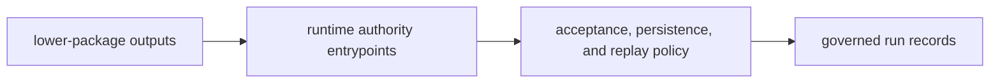

# Lifecycle Overview

The runtime lifecycle starts when lower-package work reaches an authority entrypoint and ends when the run has been accepted, persisted, and made replayable under explicit policy.

## Lifecycle Flow

This page should show runtime as the closing authority step for the package
chain. Readers should be able to see where prior work becomes an accepted run
without mistaking repository maintenance for runtime behavior.

## Lifecycle Shape

- runtime receives outputs from lower packages through governed entrypoints
- authority logic decides acceptance, persistence, verification, and replay behavior
- durable run records and traces leave the package as replayable runtime artifacts

## Handoff Point

The lifecycle stops at governed run artifacts. Repository maintenance is a separate concern owned by the maintenance handbook.

## Design Pressure

If the runtime lifecycle starts explaining repository automation or upstream
package-local semantics, the authority boundary has drifted. The package has to
end with governed run records that can stand on their own.
