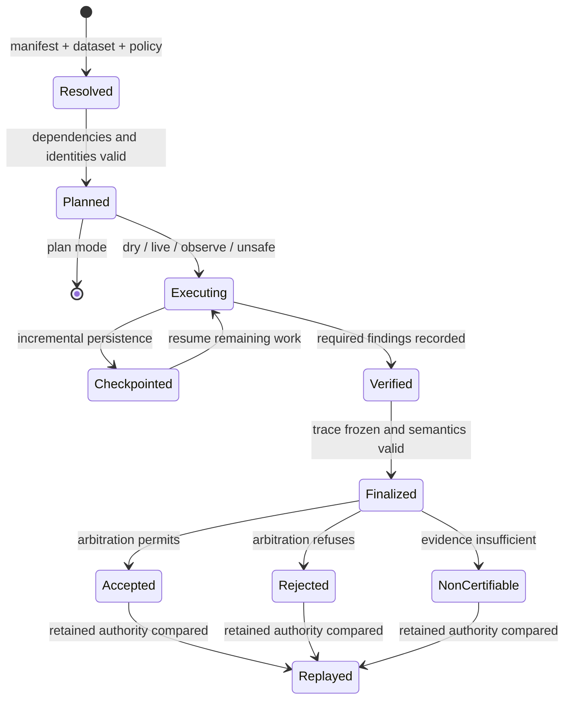

# Lifecycle Overview

The runtime lifecycle converts manifest authority into a finalized, persisted,
and replay-assessable record. Resolution, execution, verification, finalization,
acceptance, and replay are distinct stages.

```mermaid
stateDiagram-v2
    [*] --> Resolved: manifest + dataset + policy
    Resolved --> Planned: dependencies and identities valid
    Planned --> [*]: plan mode
    Planned --> Executing: dry / live / observe / unsafe
    Executing --> Checkpointed: incremental persistence
    Checkpointed --> Executing: resume remaining work
    Executing --> Verified: required findings recorded
    Verified --> Finalized: trace frozen and semantics valid
    Finalized --> Accepted: arbitration permits
    Finalized --> Rejected: arbitration refuses
    Finalized --> NonCertifiable: evidence insufficient
    Accepted --> Replayed: retained authority compared
    Rejected --> Replayed: retained authority compared
    NonCertifiable --> Replayed: retained authority compared
```

## Resolution and planning

1. Accept exactly one authority source: a manifest to resolve or an existing
   resolved plan.
2. Validate explicit determinism, replay mode and acceptability, entropy
   budget, dataset descriptor, agents, dependencies, retrieval contracts,
   verification gates, and nondeterministic intent.
3. Capture environment and package identity, normalize ordered actions, and
   produce the immutable plan hash.
4. In plan mode, return that plan without allocating a run ID or trace.

## Preparation and execution

Every non-plan mode requires a write store. Preparation registers the dataset,
begins or resumes the run, restores causal events, artifacts, evidence, tools,
claims, entropy use, and the last checkpoint, then continues indices from the
persisted state.

The selected strategy executes dry, live, observed, or explicitly unsafe work.
Only runtime authority can append governed events. Lower-layer executors return
their typed results or failures; runtime correlates them to tenant, run, step,
plan, and causal position.

## Verification and finalization

Live reasoning work requires complete verification coverage unless a recorded
failure terminates its path. Verification evaluates evidence/claim linkage,
hashes, confidence, configured rules, randomness constraints, and rule-cost
budgets. Arbitration records the participating engines, statuses, targets,
policy fingerprint, rule, and final decision.

The trace is frozen only after semantic validation. Finalization prevents
further mutation and persists the runtime projection. A finalized run may
still be rejected or non-certifiable; those are valid governed outcomes.

## Persistence and resume

DuckDB commits lifecycle record groups rather than one transaction spanning
the whole run and external world. An interruption can leave a valid unfinished
run with checkpoints. Resume is permitted only when tenant, manifest, plan,
dataset, policy, environment, and store authority remain compatible.

Artifact metadata and payload storage are separate. Complete retention requires
the database, migrations, schema hash, and referenced payloads.

## Replay

Replay loads the retained trace, dataset descriptor, envelope, and authority;
resolves the supplied manifest; executes a new governed run; and compares plan,
tenant, environment, dataset, policy, events, artifacts, evidence, entropy, and
allowed variance. The verdict can be acceptable, acceptable with warnings,
unacceptable, or non-certifiable.

Exact policy refuses every material difference. Bounded policy permits only
variance declared before the original run. Similar final content never
overrides a structural mismatch.
