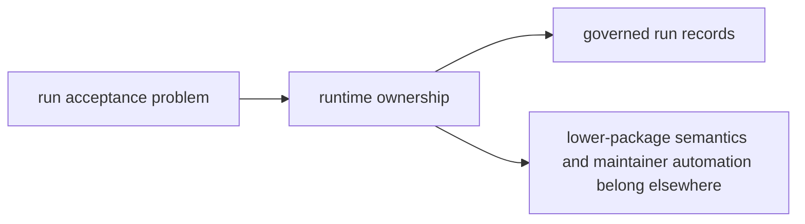

# Ownership Boundary

`bijux-canon-runtime` owns governed execution authority above the lower package family. Use it when a behavior looks close enough to local execution below that runtime might absorb work it should merely govern.

## Boundary Map

This page should make runtime feel like the authority layer for the package
chain. The boundary works only when runtime can judge prior work without
re-owning how lower packages produced it.

## Use This Boundary Test

- keep the work here when it changes acceptance, persistence, replay, execution authority, or run governance
- move the work down when it changes package-local semantics in ingest, index, reason, or agent
- move the work out to maintenance when it changes repository-wide automation rather than runtime behavior itself

## Borderline Example

A new persistence acceptance rule belongs here. A new agent-specific retry policy does not, even if runtime observes the final result.

## First Proof Check

- `packages/bijux-canon-runtime/src` for the owned implementation boundary
- `packages/bijux-canon-runtime/tests` for proof that the boundary survives change
- neighboring handbook roots in agent and the lower canonical packages when the work still looks plausible elsewhere

## Design Pressure

The pressure on runtime is to apply authority without swallowing package-local
semantics or repository automation. If acceptance policy becomes a vague excuse
for late-stage code placement, the boundary has already failed.
