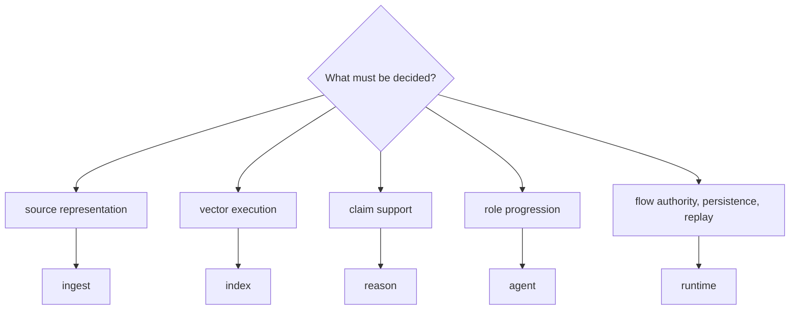

# Ownership Boundary

Runtime authority decides whether composed work may execute, persist, resume,
and count as acceptable replay. It governs lower-layer evidence without
re-owning how that evidence was produced.

```mermaid
flowchart TD
    decision{"What must be decided?"}
    prepare["source representation"]
    retrieve["vector execution"]
    interpret["claim support"]
    coordinate["role progression"]
    govern["flow authority, persistence, replay"]

    decision --> prepare --> ingest["ingest"]
    decision --> retrieve --> index["index"]
    decision --> interpret --> reason["reason"]
    decision --> coordinate --> agent["agent"]
    decision --> govern --> runtime["runtime"]
```

## Decision table

| Change | Owner | Reason |
| --- | --- | --- |
| change normalized chunk identity | ingest | changes the prepared record |
| change exact/ANN execution contract | index | changes retrieval authority |
| change whether exact bytes ground a derived claim | reason | changes reasoning evidence |
| change critique/verifier role sequence | agent | changes workflow progression |
| require a dataset descriptor before flow execution | runtime | changes admission authority |
| reject a finalized flow after verification arbitration | runtime | changes acceptance policy |
| permit bounded replay under previously declared variance | runtime | changes governed replay verdict |

## Lower-package handoff

Runtime receives typed artifacts, retrieval evidence, reasoning bundles,
verification results, agent traces, tool records, and declared failures. Those
records retain their lower-layer meaning. Runtime adds tenant, flow, plan,
environment, policy, event, entropy, persistence, and replay relationships.

If required lower-layer evidence is missing or invalid, runtime refuses or
marks the flow non-certifiable. It must not reconstruct provenance from final
text or silently relax a contract.

## Verification and arbitration

Verification engines record what they checked, which rules passed or failed,
their targets, cost, classification, and reason. Arbitration applies a policy
fingerprint and rule to those immutable observations. The arbitration decision
does not rewrite engine results.

## Runtime and maintenance

Runtime owns executable product behavior. Repository checks, synchronized
standards, release mechanics, and documentation publication belong to the
maintenance system. A command that operates the repository is not runtime
authority merely because it runs late in delivery.

## Ownership test

Ask whether the behavior changes a lower-layer semantic record or the authority
over a composed flow. The former remains with its producer. The latter belongs
here when it affects manifest admission, mode, budget, causal recording,
verification arbitration, persistence, resume, or replay verdict.
