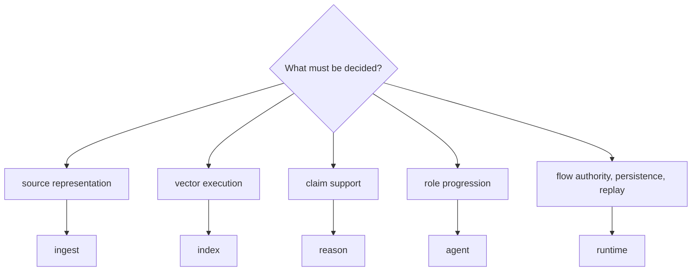
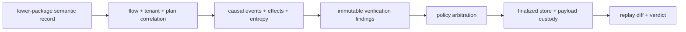

# Ownership Boundary

Runtime authority decides whether composed work may execute, persist, resume,
and count as acceptable replay. It governs lower-layer evidence without
re-owning how that evidence was produced.

```mermaid
flowchart TD
    decision{"What must be decided?"}
    prepare["source representation"]
    retrieve["vector execution"]
    interpret["claim support"]
    coordinate["role progression"]
    govern["flow authority, persistence, replay"]

    decision --> prepare --> ingest["ingest"]
    decision --> retrieve --> index["index"]
    decision --> interpret --> reason["reason"]
    decision --> coordinate --> agent["agent"]
    decision --> govern --> runtime["runtime"]
```

## Decision table

| Change | Owner | Reason |
| --- | --- | --- |
| change normalized chunk identity | ingest | changes the prepared record |
| change exact/ANN execution contract | index | changes retrieval authority |
| change whether exact bytes ground a derived claim | reason | changes reasoning evidence |
| change critique/verifier role sequence | agent | changes workflow progression |
| require a dataset descriptor before flow execution | runtime | changes admission authority |
| reject a finalized flow after verification arbitration | runtime | changes acceptance policy |
| permit bounded replay under previously declared variance | runtime | changes governed replay verdict |

## Lower-package handoff

Runtime receives typed artifacts, retrieval evidence, reasoning bundles,
verification results, agent traces, tool records, and declared failures. Those
records retain their lower-layer meaning. Runtime adds tenant, flow, plan,
environment, policy, event, entropy, persistence, and replay relationships.

If required lower-layer evidence is missing or invalid, runtime refuses or
marks the flow non-certifiable. It must not reconstruct provenance from final
text or silently relax a contract.

## Record And Payload Authority

Runtime owns the composed artifact record: its ID, tenant, type, producer,
parents, scope, content hash, and position in execution history. It does not own
a built-in durable store for the payload bytes. That separation gives three
parties distinct obligations:

| Authority | Owns | Must prove |
| --- | --- | --- |
| lower package | semantic meaning and production of the content | the record represents the output it claims to represent |
| runtime | composed identity, lineage, tenancy, policy, and replay relationships | the retained record belongs to the governed flow |
| storage integration | payload publication, retrieval, access, and retention | retrieved bytes hash to the runtime record and are authorized for the tenant |

Neither a lower-package artifact ID nor a runtime database row is sufficient
to recover content. A host integration must retain the bytes and their runtime
record as one governed set without allowing storage metadata to override
runtime authority.

## Verification and arbitration

Verification engines record what they checked, which rules passed or failed,
their targets, cost, classification, and reason. Arbitration applies a policy
fingerprint and rule to those immutable observations. The arbitration decision
does not rewrite engine results.

## Authority accumulates without replacing evidence

```mermaid
flowchart LR
    produced["lower-package semantic record"]
    correlated["flow + tenant + plan correlation"]
    observed["causal events + effects + entropy"]
    checked["immutable verification findings"]
    arbitrated["policy arbitration"]
    persisted["finalized store + payload custody"]
    replayed["replay diff + verdict"]

    produced --> correlated --> observed --> checked --> arbitrated --> persisted --> replayed
```

Each runtime stage adds an authority relationship. It may refuse progression,
but it may not alter an earlier producer record to make the later decision
pass. A rejected flow can still contain valid ingest, index, reason or agent
evidence; a successful flow cannot erase a lower-layer failure.

## Minimum governed-run handoff

| Record | Authority preserved |
| --- | --- |
| manifest, tenant, dataset and policy identities | who requested what under which declared rules |
| resolved immutable plan and environment fingerprint | which dependency order and execution environment were admitted |
| selected mode, budgets, entropy authorization and effect permissions | what execution was allowed to do |
| lower-package artifacts, evidence, claims, traces and typed failures | producer-owned semantics without runtime reinterpretation |
| ordered events, tool calls, receipts, unknown outcomes and checkpoints | causal execution and recovery boundary |
| verification findings and arbitration decision | observations remain distinct from policy acceptance |
| DuckDB/store identity plus payload hashes and authorized content references | durable metadata and retrievable bytes remain one custody set |
| finalization/certifiability and replay envelope/diff/verdict | why the run closed and whether later comparison is acceptable |

This packet supports reverse audit from replay verdict to source evidence.
Database presence, a final answer, or a successful CLI exit alone cannot stand
in for it.

## Route authority failures

| First false record | Owner |
| --- | --- |
| source, normalized document or chunk identity | ingest |
| vector artifact, capability decision, ranking or retrieval provenance | index |
| claim support, evidence bytes, checks or reasoning trace | reason |
| role transition, merge, convergence, termination or agent trace | agent |
| manifest admission, mode, tenant, effect permission, event order, arbitration, persistence, resume or replay verdict | runtime |
| repository check, workflow or publication artifact | maintenance system, not runtime |

Runtime must retain and expose an upstream failure, but the producer remains
responsible for correcting its semantic record. Runtime owns the decision to
refuse the composed flow because of that failure.

## Runtime and maintenance

Runtime owns executable product behavior. Repository checks, synchronized
standards, release mechanics, and documentation publication belong to the
maintenance system. A command that operates the repository is not runtime
authority merely because it runs late in delivery.

## Ownership test

Ask whether the behavior changes a lower-layer semantic record or the authority
over a composed flow. The former remains with its producer. The latter belongs
here when it affects manifest admission, mode, budget, causal recording,
verification arbitration, persistence, resume, or replay verdict.
