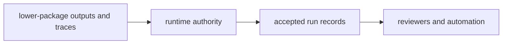

# Package Overview

`bijux-canon-runtime` exists to decide when lower-package work becomes an acceptable, persistent, replayable run. It owns governed execution authority so the system can say why one run counts and another does not.

## Role Model

This page should make runtime feel like the acceptance layer for the whole
chain. It is where prior work becomes a governed run, not where unresolved
package-local semantics get renamed as execution policy.

## Boundary Verdict

If the issue is about acceptance, replay, persistence, or governed execution authority, it belongs here. If it is about how a lower package produced its local output, runtime should consume that result rather than re-own the behavior.

## What This Package Makes Possible

- run authority becomes explicit instead of being reconstructed from logs and conventions
- replay and persistence stay tied to named runtime policy rather than ad hoc post-processing
- lower packages can stay focused on their own semantics without inheriting final authority duties

## Tempting Mistakes

- using runtime as a catch-all for late-stage code that never changes run authority
- pulling package-local semantics upward because runtime happens to see the final result
- treating persistence as enough proof even when acceptance policy is still unclear

## First Proof Check

- `packages/bijux-canon-runtime/src/bijux_canon_runtime/application/execute_flow.py` for execution authority entrypoints
- `packages/bijux-canon-runtime/src/bijux_canon_runtime/observability` for replay and durable traces
- `packages/bijux-canon-runtime/tests` for acceptance and persistence evidence

## Design Pressure

The pressure on runtime is to apply authority without re-owning how lower
packages produced their results. If acceptance policy becomes a hiding place
for upstream ambiguity, the run record loses its meaning.
