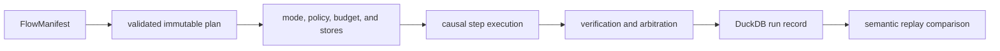

# Package Overview

`bijux-canon-runtime` turns a declared flow into a governed execution record.
It resolves immutable plans, enforces execution mode and determinism policy,
tracks entropy and artifacts, arbitrates verification, persists run evidence,
and compares replay with the original contract.

Runtime is the authority layer of the Canon chain. It consumes the semantics of
ingest, index, reason, and agent; it does not redefine them merely because it
records the final run.

## Governed Execution


```mermaid
flowchart LR
    manifest["FlowManifest"]
    plan["validated immutable plan"]
    authority["mode, policy, budget, and stores"]
    execute["causal step execution"]
    verify["verification and arbitration"]
    persist["DuckDB run record"]
    replay["semantic replay comparison"]

    manifest --> plan --> authority --> execute --> verify --> persist --> replay
```

The manifest declares flow and tenant identity, dataset identity and state,
determinism level, entropy budget, replay acceptability and envelope, agents,
dependencies, retrieval contracts, and verification gates. Planning validates
and resolves those declarations before any step gains authority to execute.

## Run Modes

| Mode | Meaning |
| --- | --- |
| `plan` | resolve and validate only; no trace or run identifier |
| `dry-run` | exercise preparation and execution checks with dry-run semantics |
| `live` | execute with normal governed side effects and persistence |
| `observe` | evaluate an existing run without silently acquiring live authority |
| `unsafe` | execute with explicitly reduced guarantees and retain that label |

Mode is part of the run contract. A dry or unsafe result cannot be promoted to
a live governed result by renaming an output file or changing presentation.

## Runtime Evidence

A completed `FlowRunResult` binds:

- the resolved manifest and plan hash;
- a finalized ordered execution trace;
- artifacts, evidence, reasoning bundles, and claim identifiers;
- tool invocations and entropy usage;
- verification-engine results and policy arbitration;
- persisted run identity and replay policy.

Plan mode intentionally returns no trace and no run ID. Executable modes need
an execution store and any policy, artifact store, observer, or verification
dependencies required by the selected mode.

## Primary Interfaces

The stable package root exports `FlowManifest`, `RunMode`, and `execute_flow`.
The CLI provides planning, persisted execution, inspection, replay, diff,
failure explanation, and database validation.

```bash
bijux-canon-runtime plan flow.json --json

bijux-canon-runtime run flow.json \
  --policy policy.json \
  --db-path artifacts/bijux-canon-runtime/runs.duckdb \
  --strict-determinism \
  --json
```

The HTTP module currently provides implemented health and readiness endpoints.
Its run and replay endpoints validate the boundary and then return `501 Not
Implemented`; they are not an alternative execution surface.

## Replay Is Policy-Aware

Replay reloads the original run, executes the current resolved flow under
replay configuration, computes semantic differences, and applies the original
acceptability contract. Exact replay blocks every semantic difference. Bounded
replay can accept only declared event, artifact, or evidence variance; tenant,
plan, dataset, environment, policy, and replay-envelope drift remain blocking.

An acceptable replay is evidence of equivalence under that declared contract,
not proof that external tools, source data, or policies outside the manifest
were unchanged.

## Ownership Boundary

Runtime owns execution authority, policy application, durable causal records,
resume, and replay acceptance. It does not own document normalization,
retrieval ranking, claim formation, or agent role semantics. A lower-package
failure remains a lower-package failure even when runtime records and halts on
it.

The `bijux-canon` and `agentic-flows` compatibility distributions preserve
established imports and commands. New integrations should use
`bijux-canon-runtime`; see
[compatibility commitments](../interfaces/compatibility-commitments.md).

Continue with [installation and setup](../operations/installation-and-setup.md)
or [common workflows](../operations/common-workflows.md).
