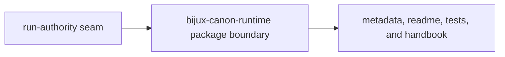

# Repository Fit

`bijux-canon-runtime` is a separate package because run authority is its own system seam. The repository needs one place where persistence, replay, and acceptance policy are explicit and reviewable.

## Fit Model

This page should explain why runtime is a publishable seam instead of a final
execution step that could hide anywhere. The fit is real only when authority is
more reviewable because the package boundary exists.

## Why This Is A Package

- `packages/bijux-canon-runtime/src/bijux_canon_runtime/application/execute_flow.py` shows the authority entrypoints
- `packages/bijux-canon-runtime/src/bijux_canon_runtime/observability` exposes the durable replay surfaces
- `packages/bijux-canon-runtime/tests` proves authority claims against acceptance and persistence behavior

## First Proof Check

- `packages/bijux-canon-runtime/pyproject.toml` for publishable package identity
- `packages/bijux-canon-runtime/README.md` for package-level reader framing
- `packages/bijux-canon-runtime/tests` for executable proof that the seam still matters

## Fit Warning

If the package is justified only because it runs last, the authority seam has collapsed into execution order.

## Design Pressure

If runtime is justified only by execution order, the authority seam has already
collapsed. The repository has to keep persistence, replay, and acceptance
policy explicit as a package boundary in its own right.
